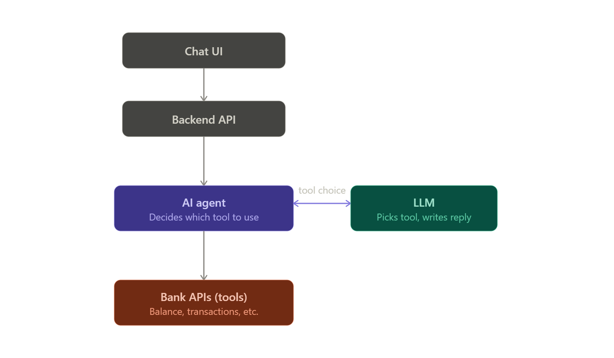
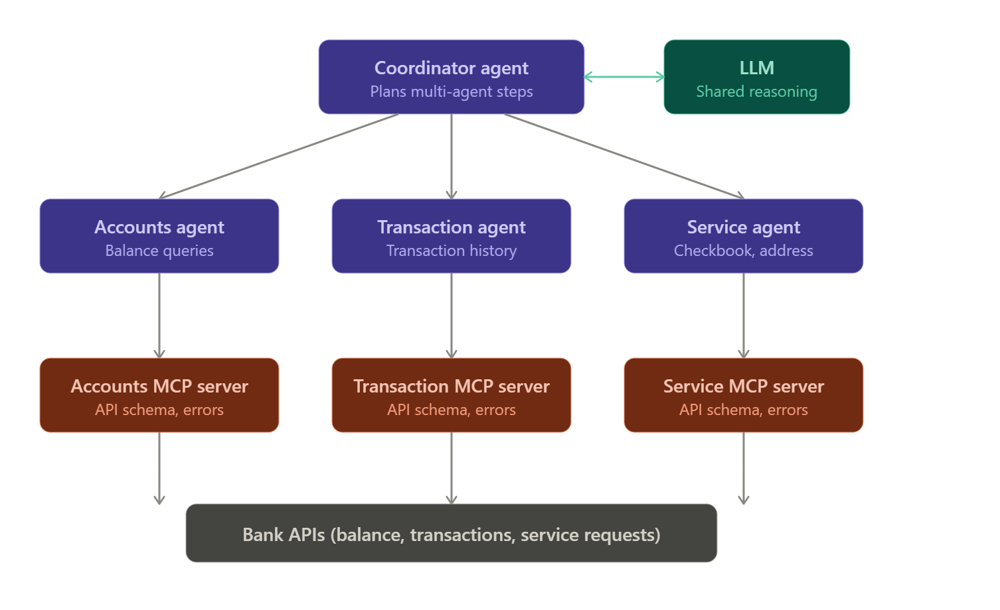
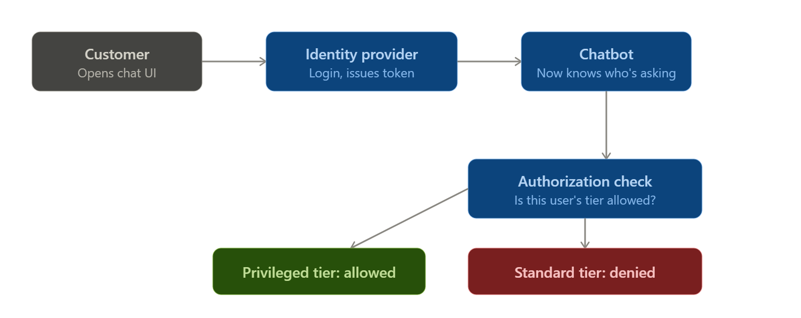
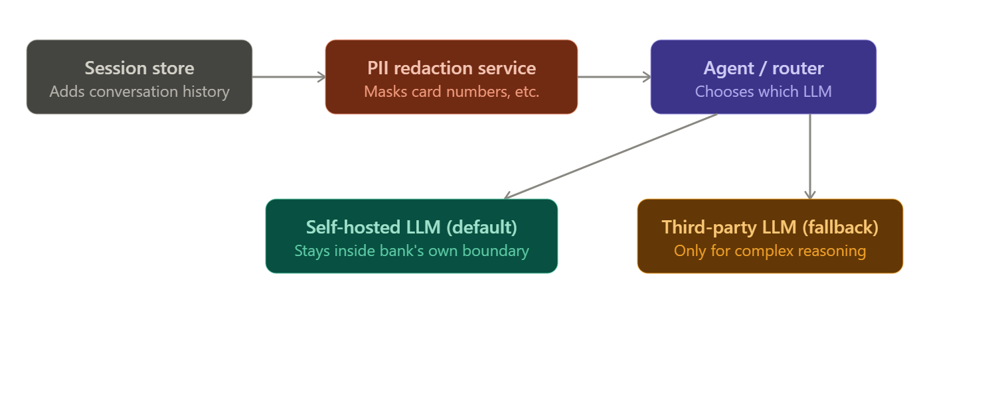
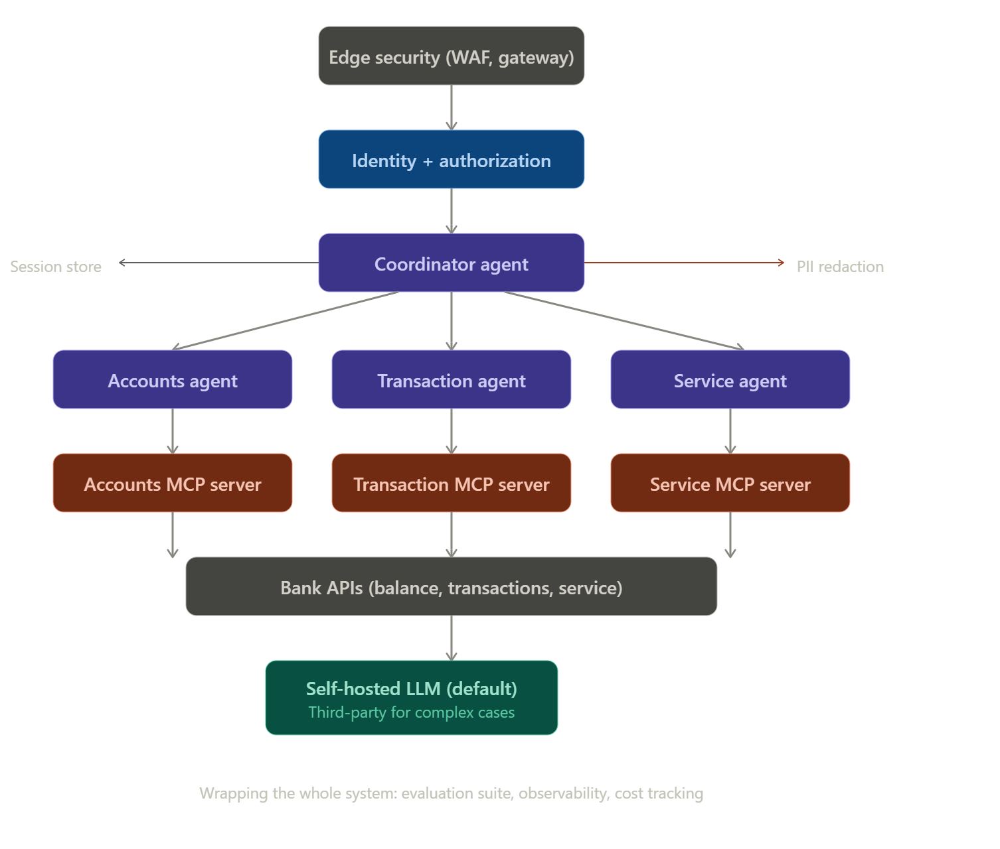

Steps 1–2: the UI hits a backend API, which hands the question to an AI agent. The agent asks the LLM which tool fits, then calls the bank's APIs directly. This works — until you attach 30–40 tools to one agent and the LLM starts picking the wrong one (tool confusion/overload).

That overload is what forces the next redesign: split into domain-specific sub-agents, add a coordinator to orchestrate them, and move tool integration behind MCP servers so agents only reason, never do API plumbing.

Steps 3–5: three domain sub-agents replace the one overloaded agent, a coordinator plans across them for multi-domain questions, and each sub-agent's tool integration is pushed out to its own MCP server — so agents only decide which tool to call, never how.

This design has a hole though: nothing checks who's asking. Next comes authentication (confirming identity) and authorization (confirming permissions).

Steps 6–8: login through the bank's own identity provider stamps every request with the user's identity (authentication); a separate check against the user's tier decides what they're allowed to do (authorization) — this is what stops a standard customer from raising their own credit limit.

Two more gaps remain: the LLM has no memory across turns, and sensitive data (like a full credit card number) can leak straight to a third-party LLM. Here's how both get handled.

Steps 9–10: the session store gives the LLM memory of prior turns (LLMs are stateless otherwise), and PII redaction runs before anything leaves for a model — with a self-hosted LLM as the default so bank data stays in-boundary, and a third-party LLM used sparingly, only when reasoning gets genuinely complex.

The last diagram pulls everything together — this is the full production-ready architecture from the video, including the pieces that never touch the model at all: evaluation, observability, cost tracking, and edge-layer network security.

This is the final production architecture: edge security → auth/authorization → coordinator agent → three domain sub-agents each backed by an MCP server → bank APIs, with a session store and PII redaction feeding into a self-hosted LLM (third-party only for complex reasoning) — and evaluation, observability, and cost tracking wrapping the entire system rather than sitting in the request path.

I've also saved the full written notes covering every step in detail, including the business case and the AI-vs-software-engineering distinction the video keeps returning to: