# Step 1 — Architecture Diagram

Basic chatbot, no data access. The agent only talks to the LLM — it cannot see any
bank account, transaction, or customer data at this stage.

```mermaid
flowchart LR
    User(["Customer"])
    UI["Chat UI\n(frontend/index.html)"]
    API["Backend API\n(FastAPI - /api/chat)"]
    Agent["Agent\n(system prompt, no tools)"]
    LLM["LLM\n(Claude - claude-opus-5)"]

    User -->|types a question| UI
    UI -->|POST /api/chat| API
    API --> Agent
    Agent -->|messages.create| LLM
    LLM -->|natural-language answer| Agent
    Agent --> API
    API -->|JSON response| UI
    UI -->|renders reply| User

    classDef software fill:#2563eb22,stroke:#2563eb;
    classDef ai fill:#16a34a22,stroke:#16a34a;
    class UI,API software;
    class Agent,LLM ai;
```

**Legend:** blue = general software engineering, green = AI engineering.

**What's deliberately missing at Step 1** (added in later steps):
- No tools / bank API access → Step 2
- No sub-agents / coordinator → Steps 3–4
- No MCP servers → Step 5
- No authentication or authorization → Steps 6–8
- No session/memory store → Step 9
- No PII redaction → Step 10
- No eval suite, observability, cost tracking, or edge security → Steps 11–14
