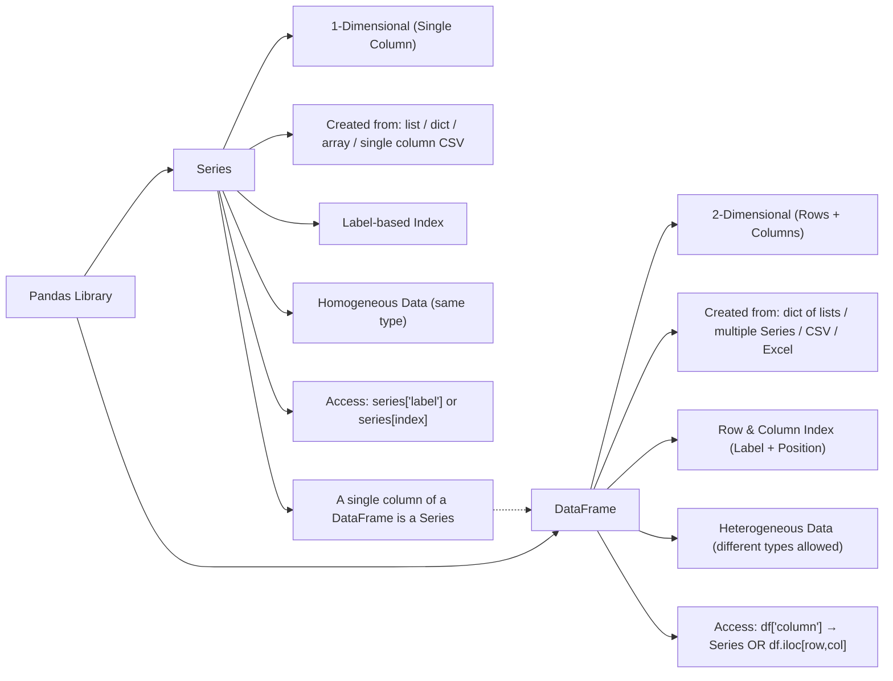

# 🧠 AI / ML Notes – Day 1 - Python installation and basices 

📅 **Date:** Sept 15

---

## 🐍 Python Setup

### ✅ Install Python

1. Install Python
2. Open **Command Prompt**
3. Run:

   ```bash
   pip install jupyter
   ```
4. Create a **shortcut key** for Jupyter Notebook
5. Change the **Start In path** in shortcut properties

💡 You can also use **Google Colab** instead of local Jupyter.

---

## 🧩 Program Flow

**Input → Process → Output**

---

### 🖥️ Input

Data can come from:

* User Interface
* CSV files
* APIs
* SQL Databases

**Example:**

```python
marks = input('Enter your marks: ')
```

---

## 📦 Data Structures

### 🧮 List

* **Insertion order preserved**
* **Duplicates allowed**
* **Heterogeneous objects allowed** (e.g., `[10, 'apple', 34.5]`)
* **Mutable** – can change elements
* **Dynamic** – can increase or decrease size

**Example:**

```python
lst = [10, 20, 30, 40, 50]
print(lst)
# Output: [10, 20, 30, 40, 50]

lst.append(1000)
lst.pop()
```

---

### 📚 Tuple

* **Immutable** – cannot change after creation
* Supports **packing** and **unpacking**
* A single-element tuple must have a comma → `(10,)`

**Example:**

```python
t1 = 10, 20, 30  # tuple packing
x, y, z = t1     # tuple unpacking
print(x, y, z)
# Output: 10 20 30

t4 = (10, 20, 30)
print(t4)
print(type(t4))
```

> A tuple with one element like `(10)` is not a tuple — it’s an integer.

---

### 🧮 Set

* **Unordered** (no insertion order)
* **No duplicate elements**
* **Mutable**
* Can perform **mathematical operations**

**Example:**

```python
set1 = {10, 20, 30, 40, 50}
print(set1)
# Output: {40, 10, 50, 20, 30}
```

---

### 📘 Dictionary

* Data from APIs often comes in **JSON**, which maps to **Python dictionary**
* **No indexing**
* **Access values by keys**
* **Keys must be unique**

**Example:**

```python
d1 = {'Name': 'Navid', 'Age': 40}
print(d1)
print(d1.keys())
print(d1.values())
print(d1.items())
```

**Find specific values in dictionary:**

```python
for key, value in d1.items():
    if value == 'Mango':
        print(key, value)
```

---

### 🔢 Advanced Data Structures

* **NumPy** → Numerical computations
* **Pandas** → Data manipulation and analysis

---

### 💡 Flask Framework

We can use **Flask** to build small **web applications** for AI/ML models.

---

## ⚙️ Process Module

**Example Calculations:**

```python
result = 10 + 20
print(result)   # 30

result = 10 / 20
print(result)   # 0.5

result = 22 / 7
print(result)   # 3.142857...

result = 22 % 7
print(result)   # 1  (% gives remainder)

result = 2 * 4
print(result)   # 8

result = 2 ** 4
print(result)   # 16 (power operator)
```

---

## 🔢 Indexing

| Index Type        | Direction    | Example          |
| ----------------- | ------------ | ---------------- |
| Positive Indexing | Left → Right | `0, 1, 2, 3`     |
| Negative Indexing | Right → Left | `-4, -3, -2, -1` |

**Example:**

```python
lst = [10, 30, 50, 60]
print(lst[0])   # 10
print(lst[-3])  # 30
```

---

## ✂️ Slice Operator

**Syntax:**

```
list[start : stop : step]
```

**Example:**

```python
lst = [10, 20, 30, 50, 80, 35]
sub_lst = lst[0:3]
print(sub_lst)
# Output: [10, 20, 30]
```

> Slice always goes up to `n-1` (stop is excluded)

---

## 🔁 Reverse a List

```python
lst = [10, 20, 30, 50, 60]
rev_list = lst[::-1]
print(rev_list)
# Output: [60, 50, 30, 20, 10]
```

* **First:** default start of list
* **Second:** default end of list
* **Step (-1):** reverses order

---

### 🔢 More Slice Examples

```python
lst = [10, 20, 30, 50, 60]

print(lst[2:5:1])   # [30, 50, 60]
print(lst[2:5:-1])  # []
print(lst[5:2:-1])  # [60, 50, 30]
print(lst[5:2:1])   # []
```

---

## 🧾 Dictionary Example

```python
d1 = {'empid': 10, 'name': 'Navid'}
print(d1)
print(d1.keys())
print(d1.values())
print(d1.items())
```

---

## 🧮 Set Examples

```python
d1 = {}
print(type(d1))  # <class 'dict'>

s1 = {10, 20, 30}
print(s1)
# Output: {10, 20, 30}

s2 = {10, 20, 30, 10}
print(s2)
# Output: {10, 20, 30}
```

### Set Operations

```python
# Union
s1 | s2  # or s1.union(s2)

# Difference
s1 - s2

# Symmetric Difference
s1 ^ s2  # Elements in s1 or s2, but not both
```

---

## 🧮 Example – Input and Print

```python
marks = input('Enter your marks: ')
print('You scored:', marks)
```

---

## 🧠 Notes Recap

| Concept            | Description                         |
| ------------------ | ----------------------------------- |
| **List**           | Ordered, mutable, allows duplicates |
| **Tuple**          | Ordered, immutable                  |
| **Set**            | Unordered, unique values            |
| **Dictionary**     | Key-value pairs                     |
| **NumPy / Pandas** | Advanced data structures            |
| **Flask**          | For web app deployment              |

---

# 🤖 AI / ML Notes – Day 2 & Day 3 - 📚 **Topic:** Functions, Decorators, and Exception Handling


---

## 🧩 What is a Function?

A **function** is a block of reusable code designed to perform a specific task.

> 💡 If a set of statements is required repeatedly, it’s inefficient to rewrite them.
> Instead, define a **function** once and call it wherever needed.

---

### ✅ Advantages of Functions

* Reduces lines of code
* Improves readability and debugging
* Enhances reusability
* Easy to maintain and extend

---

### 🧠 Example – Reusable Function

```python
def fun():
    print('Hello Python')

fun()
fun()
```

---

## ⚙️ Types of Functions in Python

1. **Built-in Functions** → predefined (e.g. `print()`, `len()`, `type()`)
2. **User-defined Functions** → created by the programmer

---

### 🧮 Example – Built-in Functions

```python
id()
type()
print()
input()
eval()
```

---

### 🧠 Example – User-defined Function

```python
def greet():
    print("Hello from a user-defined function!")

greet()
```

---

## 📦 Function Syntax

```python
def function_name(parameters):
    statements
    return value
```

* `def` → keyword to define a function
* `return` → optional; used to send data back to the caller

---

### Example – Function with Return Value

```python
def addition(a, b):
    return a + b

result = addition(10, 20)
print(result)  # Output: 30
```

If no `return` is used, the function returns `None`.

---

### Example – Return None by Default

```python
def fun():
    print('Hello Python')

print(fun())
# Output:
# Hello Python
# None
```

---

## 🎯 Function Parameters

**Formal Parameters** → variables defined inside the function
**Actual Arguments** → values passed when calling the function

```python
def addition(a, b):
    return a + b

print(addition(10, 20))
print(addition(15, 25))
```

---

## 🔁 Returning Multiple Values

Python allows returning **multiple values** (as a tuple).

```python
def sum_sub(a, b):
    return a + b, a - b

x, y = sum_sub(10, 20)
print('Sum:', x)
print('Sub:', y)
```

---

## ⚙️ Types of Arguments

1. **Positional Arguments**
2. **Keyword Arguments**
3. **Default Arguments**
4. **Variable-Length Arguments**

---

### 1️⃣ Positional Arguments

```python
def sub(a, b):
    print(a - b)

sub(10, 20)
sub(20, 10)
```

---

### 2️⃣ Keyword Arguments

```python
def student_info(rollno, name, marks):
    print('Roll No:', rollno)
    print('Name:', name)
    print('Marks:', marks)

student_info(name='Navid', rollno=9, marks=90)
```

---

### 3️⃣ Default Arguments

```python
def sum(a, b=0):
    return a + b

print(sum(10))
print(sum(10, 20))
```

---

### 4️⃣ Variable-Length Arguments

#### `*args` → multiple positional arguments as tuple

```python
def student_info(*info):
    print('Student Info:')
    for i in info:
        print(i)

student_info(101, 'Rakesh', 400, 'Delhi')
```

#### `**kwargs` → multiple keyword arguments as dictionary

```python
def student_info(**kwargs):
    for key, value in kwargs.items():
        print(f'{key} : {value}')

student_info(rollno=101, name='Rakesh', marks=300, city='Delhi')
```

---

## 🌍 Variable Scope

### 1️⃣ Global Variables

```python
a = 10

def fun1():
    print('a in fun1:', a)

def fun2():
    print('a in fun2:', a)

fun1()
fun2()
```

---

### 2️⃣ Local Variables

```python
def fun1():
    a = 10
    print('Local a:', a)

def fun2():
    print(a)  # Error

fun1()
fun2()
```

---

## 🌐 The `global` Keyword

Used to:

1. Declare a global variable inside a function
2. Modify a global variable within a function

---

### Example – Modify Global Variable

```python
a = 10

def fun1():
    global a
    a = 999
    print('a in fun1:', a)

fun1()
print('a outside:', a)
```

---

### Example – Access Global Variable When Local Exists

```python
a = 10

def fun1():
    a = 999
    print('Local a:', a)
    print('Global a:', globals()['a'])

fun1()
```

---

## 🧠 Nested Functions

We can declare a function inside another function.
Such functions are called **nested functions**.

---

### Example 1

```python
def outer():  # 1. Define outer function
    print('Outer Function started')  # 2. Print from outer

    def inner():  # 3. Define inner function
        print('Inner Function execution')

    print('Outer Function calling Inner Function')
    inner()  # Call inner function

outer()  # Call outer function
````

**Output:**

```
Outer Function started
Outer Function calling Inner Function
Inner Function execution
```

---

### Example 2 – Calling Inner Before Print

```python
def outer():
    print('Outer function started')
    def inner():
        print('Inner function started')
    inner()
    print('Outer function calling Inner function')

outer()
```

---

### Example 3 – Return Inner Function

```python
def outer():
    print('Outer function started')
    def inner():
        print('Inner function started')
    print('Outer function calling Inner function')
    return inner

fun_1 = outer()  # only runs outer()
fun_1()          # now runs inner()
```

* **Explanation:**

  * `outer()` prints outer messages and returns reference to `inner`.
  * `fun_1()` executes the returned `inner()`.

---

## 🎨 Function Decorators

A **decorator** is a function which takes another function as argument,
**extends its functionality**, and returns the modified function.

📌 *Analogy:*
A decorator is like someone who decorates your room —
the structure remains, but its appearance is enhanced.

---

### Example 1 – Without `@decorator`

```python
def ordinary():
    print('I am an ordinary function.....')

def makemepretty(func):  # decorator
    def inner_func():
        print('Now I am pretty')
        func()
    return inner_func()

# Apply decorator manually
pretty = makemepretty(ordinary)
```

---

### Example 2 – With `@decorator`

```python
def makemepretty(func):
    def inner_func():
        print('Now I am pretty')
        func()
    return inner_func

@makemepretty
def NewOrdinary():
    print('I live in Nanded \n', 'Development needed here')
```

**Output:**

```
Now I am pretty
I live in Nanded 
Development needed here
```

---

## ⚠️ Exception Handling

Two kinds of errors:

1. **Compile-time (Syntax errors)**
2. **Runtime errors (Exceptions)**

An **exception** is an unwanted/unexpected event
that disturbs the normal flow of the program.

Examples: `ZeroDivisionError`, `ValueError`, `TypeError`, `EOFError`, etc.

---

### Without Handling

```python
a = int(input('Enter any number : '))
b = int(input('Enter any number : '))
c = a / b
```

If `b = 0`, output:

```
ZeroDivisionError: division by zero
```

---

### With `try-except`

```python
c = 0
try:
    a = int(input('Enter any number : '))
    b = int(input('Enter any number : '))
    c = a / b
except (ZeroDivisionError, ValueError) as msg:
    print('Exception Occurred:', msg)

print('Value of c :', c)
print('Thank you')
```

**Output Example:**

```
Enter any number : 10
Enter any number : 0
Exception Occurred : division by zero
Value of c : 0
Thank you
```
  
---

### Generic `Exception`

```python
c = 0
try:
    a = int(input('Enter any number : '))
    b = int(input('Enter any number : '))
    c = a / b
except Exception as msg:  # catches all exceptions
    print('Exception Occurred:', msg)

print('Value of c :', c)
print('Thank you')
```

---

## 🧹 Finally Block

Always executes cleanup code whether exception occurs or not.

```python
c = 0
try:
    a = int(input('Enter any number : '))
    b = int(input('Enter any number : '))
    c = a / b
except (ZeroDivisionError, ValueError) as msg:
    print('Exception Occurred:', msg)
finally:
    print('Finally Block : Cleanup Code')

print('Value of c :', c)
print('Thank you ')
```

**Output:**

```
Enter any number : 10
Enter any number : 20
Finally Block : Cleanup Code
Value of c : 0.5
Thank you
```

---

## ✅ Else Block with Try-Except-Finally

* `else` → runs only if no exception occurs
* `finally` → always executes

```python
c = 0
try:
    a = int(input('Enter any number : '))
    b = int(input('Enter any number : '))
    c = a / b
except (ZeroDivisionError, ValueError) as msg:
    print('Exception Occurred:', msg)
else:
    print('Value of c :', c)
finally:
    print('Finally Block : Cleanup Code')

print('Thank you ')
```

**Output:**

```
Enter any number : 10
Enter any number : 20
Value of c : 0.5
Finally Block : Cleanup Code
Thank you
```

---

## 🚨 User-Defined Exception (Custom Exception)

Also known as **customized/programmatic exceptions**.
Defined and raised explicitly by programmers.

```python
class MyException(Exception):  # must inherit from Exception
    def __init__(self, *args):
        self.msg = args

try:
    temp = int(input("Enter Temperature: "))
    if temp < 20:
        raise MyException("Low Temperature")
    print('Temperature is:', temp)
except MyException as msg:
    print("Error:", msg)

print('Thank you ')
```

**Output:**

```
Enter Temperature: 15
Error: ('Low Temperature',)
Thank you
```

📌 Note: `raise` is best for **customized exceptions**,
not for predefined ones.

---

# 🧾 Summary

| Concept                | Description                |
| ---------------------- | -------------------------- |
| **Function**           | Reusable block of code     |
| **Return**             | Sends value back to caller |
| **Args / Kwargs**      | Variable-length arguments  |
| **Global / Local**     | Variable scope control     |
| **Nested Function**    | Function inside another    |
| **Decorator**          | Enhances existing function |
| **Exception Handling** | Controls runtime errors    |
| **Finally / Else**     | Cleanup and success blocks |
| **Custom Exception**   | User-defined runtime error |

---

# Day 4: AI - 28th Sept - 2025 - Regular expression

### Regular Expressions

If a group of strings needs to be represented according to a particular format or pattern, Regular Expressions should be used.

A Regular Expression is a declarative mechanism to describe a group of strings that follow a particular format/pattern.

**Examples:**  
- We can write a regular expression to represent all mobile numbers.  
- We can write a regular expression to represent all email IDs.

**Main application areas of Regular Expressions:**  
1. Developing validation frameworks/validation logic.  
2. Developing pattern matching applications (e.g., ctrl+F in Windows, grep in Unix).  
3. Building translators such as compilers and interpreters.  
4. Creating digital circuits.  
5. Developing communication protocols (TCP/IP, UDP, etc.), such as matching IP addresses (e.g., 192.168.1.101).

Regular Expression-based applications can be developed in Python using the `re` module.

This module provides several built-in functions for using Regular Expressions easily in applications.

#### 1. `compile()`  
- The `re` module provides the `compile()` function, which compiles a pattern into a RegexObject.

#### 2. `finditer()`  
- Returns an iterator that yields Match objects for every match found.

**Example:**  
```python
matcher = pattern.finditer("abaabababa")
```

For the Match object, the following methods can be called:  
- `start()` returns the starting index of the match.  
- `end()` returns the end (index + 1) of the match.  

***  

#### group()  
- `group()` returns the matched string.  

***  

### Example  

```python
import re
count = 0

pattern = re.compile("ab")
matcher = pattern.finditer("abaabababa")

for match in matcher:
    count += 1
    print(match.start(), match.end(), match.group())

print('The number of occurrences:', count)
```

**Output:**  
```
0 2 ab
3 5 ab
5 7 ab
The number of occurrences: 3
```

***  

### Character Classes

Character classes let us search for a group of characters:

| Expression      | Meaning                                          |
|-----------------|-------------------------------------------------|
| [abc]           | Either 'a', 'b', or 'c'                         |
| [^abc]          | Except 'a', 'b', and 'c'                        |
| [a-z]           | Any lowercase alphabet symbol                    |
| [A-Z]           | Any uppercase alphabet symbol                    |
| [0-9]           | Any digit from 0–9                               |
| [a-zA-Z]        | Any alphabetic symbol                            |
| [a-zA-Z0-9]     | Any alphanumeric character                       |
| [^a-zA-Z0-9]    | Except alphanumeric characters (special chars) |  

***  

### Example: Using Character Classes in Regular Expressions  

```python
import re

print('---------------------------------------------')
x = "[abc]"
print('Character Class :', x)

matcher = re.finditer(x, "a7b@k9z")
for match in matcher:
    print(match.start(), '-------', match.group())

print('---------------------------------------------')
x = "[^abc]"
print('Character Class :', x)

matcher = re.finditer(x, "a7b@k9z")
for match in matcher:
    print(match.start(), '-------', match.group())

print('---------------------------------------------')
x = "[a-z]"
print('Character Class :', x)

matcher = re.finditer(x, "a7b@k9z")
for match in matcher:
    print(match.start(), '-------', match.group())
```

***  

### Pre-defined Character Classes  

| Expression   | Description                                                               |
|--------------|---------------------------------------------------------------------------|
| `\s`         | Space character                                                           |
| `\S`         | Any character **except** space character                                  |
| `\d`         | Any digit (**0–9**), e.g., `[0-9]`                                        |
| `\D`         | Any character **except** digit, e.g., `[^0-9]`                            |
| `\w`         | Any word character (alphanumeric + underscore), e.g., `[a-zA-Z0-9_]`      |
| `\W`         | Any character **except** word character (special characters)              |
| `.`          | Any character, including special characters                               |  

***  

### Example  

```python
import re

print('---------------------------------------------')
x = "\s"
print('Pre-defined Character Class :', x)
matcher = re.finditer(x, "a7b k@9z")
for match in matcher:
    print(match.start(), '-------', match.group())

print('---------------------------------------------')
x = "\S"
print('Pre-defined Character Class :', x)
matcher = re.finditer(x, "a7b k@9z")
for match in matcher:
    print(match.start(), '-------', match.group())

print('---------------------------------------------')
x = "\d"
print('Pre-defined Character Class :', x)
matcher = re.finditer(x, "a7b k@9z")
for match in matcher:
    print(match.start(), '-------', match.group())
```

***  

### Quantifiers  

Quantifiers specify how many times a character or group should be matched:

| Pattern  | Meaning                                |
|----------|---------------------------------------|
| `a`      | Exactly one 'a'                       |
| `a+`     | At least one 'a'                      |
| `a*`     | Any number of 'a's including zero     |
| `a?`     | At most one 'a' (zero or one)         |
| `a{m}`   | Exactly m number of 'a's              |
| `a{m,n}` | Minimum m and maximum n number of 'a's|  

**Special note:**  
- `^` checks if the string starts with the given pattern.  
- `$` checks if the string ends with the given pattern.  

***  

### Examples  

```python
import re

print('---------------------------------------------')
x = "a+"
print('Quantifier pattern:', x)
matcher = re.finditer(x, "abaaaaab")
for match in matcher:
    print(match.start(), '-------', match.group())

print('---------------------------------------------')
x = "a*"
print('Quantifier pattern:', x)
matcher = re.finditer(x, "abaaaab")
for match in matcher:
    print(match.start(), '-------', match.group())
```

***  

Continuing the formatted content from where we left off:

***

### Important Functions of the `re` Module

1. `match()`  
2. `fullmatch()`  
3. `search()`  
4. `findall()`  
5. `finditer()` – Returns an iterator yielding Match objects for every match  
6. `sub()`  
7. `subn()`  
8. `split()`  
9. `compile()` – Compiles a pattern into a RegexObject

#### Example: Using `match()` function

```python
import re
str1 = 'ababcabdefg'
s1 = input("Enter Pattern to check: ")
m = re.match(s1, str1)

if m is None:
    print('Match is not available at the beginning of the string.')
else:
    print('Match is available at the beginning of the string.')
```

This code checks whether the pattern exists **at the beginning** of `str1`. If the match is not found, it notifies the user.

***

### 2. `fullmatch()`

- Matches the entire target string against a pattern.
- Returns a Match object if full string matches, else None.

```python
import re

str1 = 'abcd'
s = input("Enter Pattern to check: ")
m = re.fullmatch(s, str1)

if m is not None:
    print('FullMatch is available for the string.')
else:
    print('FullMatch is not available for the string.')
```

***

### 3. `search()`  

- Searches the given pattern anywhere in the string.
- Returns the first Match object if found, else None.

```python
import re

str1 = 'abcabdefg'
s = input("Enter Pattern to check: ")
m = re.search(s, str1)

if m is not None:
    print('First occurrence start index:', m.start(), 'End index:', m.end())
else:
    print('Match not found in the string.')
```

***

### 4. `findall()`  

- Returns a list of all matches found (non-overlapping).

```python
import re

msg = "Python is an easy programming language. Python is good lang"
s1 = input('Enter Search Word: ')

matches = re.findall(s1, msg)
print(matches)
```

Example input `"Python"` outputs:  
```
['Python', 'Python']
```

***

### 5. `findall()` Example to Find Digits

```python
import re

digits = re.findall(r'[0-9]', 'a7b9c5kz')
print(digits)
```

Output:  
```
['7', '9', '5']
```

***

### 6. `sub()` (Substitution)

- Replaces every matched pattern with the specified replacement.

```python
import re

result = re.sub(r'[a-z]', '#', 'a7b9c5kz')
print(result)
```

Output:  
```
#7#9#5#8#
```

***

### 6. `sub()` Example – Interactive Replacement

```python
msg = 'Python is an easy programming language. Python is good language'
import re

s1 = input('Enter Search Word: ')
s2 = input('Enter New Word: ')

result = re.sub(s1, s2, msg)
print(result)
```

***

### 7. `subn()`

- Like `sub()`, but also returns the number of replacements as a tuple.

```python
import re

t = re.subn('[a-z]', '#', 'a7b9c5k8z')
print(t)
print('Result string:', t[0])
print('Number of replacements:', t[1])
```

Output:  
```
('#7#9#5#8#', 5)
Result string: #7#9#5#8#
Number of replacements: 5
```

***

### 1. Regular Expression for 10-digit Mobile Numbers

Rules:  
- Exactly 10 digits.  
- First digit is 7, 8, or 9.

Patterns:  
```python
[7-9][0-9]{9}
# or
(7|8|9)\d{9}
```

***

### 2. Check if String Starts with “r” and Ends with “h”

```python
import re

pattern = r'^r.*h$'
result = re.match(pattern, "rakesh")
print(result is not None)  # True for "rakesh"
```

***

### 3. Valid Email Address Check

```python
import re

def is_valid_email(email):
    pattern = r'[a-zA-Z0-9._%+-]+@[a-zA-Z0-9.-]+\.[a-zA-Z]{2,}$'
    return re.match(pattern, email) is not None

def main():
    email = input("Enter an email address: ")
    if is_valid_email(email):
        print("Valid email address")
    else:
        print("Invalid email address")

if __name__ == "__main__":
    main()
```

***

### Extract Mobile Numbers and Email Addresses from File

```python
import re

file = open('Data.txt')
data = file.read()

pattern_mobile = r'[7-9]\d{9}'
mobile_numbers = re.findall(pattern_mobile, data)

pattern_email = r'[a-zA-Z0-9._%+-]+@[a-zA-Z0-9.-]+\.[a-zA-Z]{2,}$'
email_addresses = re.findall(pattern_email, data)

for m in mobile_numbers:
    print(m)
for e in email_addresses:
    print(e)
```

***

Continuing with Object-Oriented Programming (OOP) content formatting:

***

### Python's Object Oriented Programming (OOP): What is a Class?

1. In Python, everything is an object. To create an object, a model or blueprint called a *class* is required.
2. A class represents properties (attributes) and actions (behavior) of objects. For example, `lst.append(40)` uses a method on a list object.
3. Properties are represented by variables.
4. Actions are represented by methods.
5. Therefore, a class contains both variables and methods.

**Example analogy:**  
- Earlier, we prepared food at home.  
- Now, we go out and get food.   
- Similarly, earlier we assembled laptops at home; now, we assemble laptops in the market.

***

### Terminology Example

- Objects like tables, chairs, and mobiles belong to classes such as Furniture and Electronics.
- Furniture class has objects like chairs and tables.
- Mobile class has objects like specific mobile phones.

***

### How to Define a Class

A class is defined using the `class` keyword.

**Syntax:**

```python
class ClassName:
    '''Documentation string'''
    # Variables: instance variables, static variables, local variables
    # Methods: instance methods, static methods, class methods
```

- The documentation string describes the class; it's optional but recommended for clarity.

***

### Accessing Docstring of a Class

```python
print(ClassName.__doc__)
help(ClassName)
```

Example:

```python
list.__doc__
str.__doc__
tuple.__doc__
```

***

### Types of Variables in Python Classes

1. **Instance Variables:** Object-level, unique per instance.  
2. **Static Variables:** Class-level, shared among all instances.  
3. **Local Variables:** Method-level, accessible only within methods.

***

### Types of Methods in Python Classes

1. **Instance Methods:** Operate on instance data.  
2. **Class Methods:** Operate on the class itself, marked with `@classmethod`.  
3. **Static Methods:** No reference to instance or class, marked with `@staticmethod`.

***

### What is an Object?
ex: steave job have one idea like for apple mobile which is in his mind, now he given the mobile or blueprint to users, here mobile is object.

- The physical existence of a class — an instance created from the class blueprint.  
- Any number of objects can be created from a class.

Syntax:

```python
reference_variable = ClassName()
# Example
s = Student()
```

***

### What is a Reference Variable?

- Reference variable refers to an object, allowing access to its properties and methods.

***

### The `self` Variable

- `self` refers to the current instance of the class, similar to `this` in other languages.  
- Used inside constructors (`__init__`) and instance methods to access instance variables and methods.

**Notes:**

1. `self` must be the first parameter in constructors and instance methods.  
2. Example method header:  
```python
def show(self):
    pass
```

***

### Constructor Concept in Python

1. A constructor is a special method `__init__` called automatically when an object is created.  
2. Its main purpose is initializing instance variables.  
3. Must take at least the `self` parameter.  
4. If not provided, Python supplies a default constructor.

Example:

```python
def __init__(self, name, rollno, marks):
    self.name = name
    self.rollno = rollno
    self.marks = marks
```

***

Continuing with formatted content including class examples:

***

## Example: Employee Class with Instance Variables and Methods

```python
class Employee:
    '''This is an example Employee class.'''
    
    def __init__(self, id, nm, sal):
        self.empID = id       #  This block is Instance variable or object level variable 
        self.name = nm
        self.salary = sal
    
    def show_empinfo(self):
        print('Employee ID:', self.empID)
        print('Employee Name:', self.name)
        print('Salary:', self.salary)
    
    def get_pf_da_info(self):
        print('PF:', self.salary * 0.10)
        print('DA:', self.salary * 0.15)
```

### Using the Employee Class and Objects

```python
emp1 = Employee(101, 'Navid', 50000)
emp2 = Employee(201, 'Ali', 90000)

print(id(emp1))
print(type(emp1))

emp1.show_empinfo()
emp2.show_empinfo()

emp1.get_pf_da_info()
```

**Explanation:**  
- `self` refers to the current object.  
- Each object `emp1`, `emp2` has its own data.

***

## Example: Bank Class with Static and Instance Variables

```python
class Bank:
    ifsc_code = 98212  # Static variable shared by all instances
    
    def __init__(self, an, nm, bal):
        self.accno = an      # Instance variables unique to each instance
        self.name = nm
        self.balance = bal
    
    def show_acc_info(self):
        print('Account No:', self.accno)
        print('Name of account holder:', self.name)
        print('Balance in the account:', self.balance)
        print('IFSC of your account:', self.ifsc_code)
```

### Using the Bank Class and Objects

```python
ac1 = Bank(1001, 'navid', 48592)
ac2 = Bank(1024, 'bob', 48291)
ac3 = Bank(1234, 'yogesh', 1482)

ac1.show_acc_info()
ac2.show_acc_info()
ac3.show_acc_info()

# Update the static variable for all accounts
Bank.ifsc_code = 2931

ac1.show_acc_info()
ac2.show_acc_info()
ac3.show_acc_info()

# Override static variable for an instance
ac1.ifsc_code = 200
ac1.show_acc_info()
```

***

---

# Day 5: AI/ML - Oct 4, 2025

* setter and getter
* property of class
* decorator example
* over loading
* overriidding

---

## Setter and Getter Methods

We can set and get the values of instance variables by using getter and setter methods.

### Setter Method

Setter methods (also known as mutator methods) are used to set values to instance variables.

**Syntax:**

```python
def setVariable(self, variable):
    self.variable = variable
```

**Example:**

```python
def setRollno(self, rollno):
    self.rollno = rollno
```

---

### Getter Method

Getter methods (also known as accessor methods) are used to get values of instance variables.

**Syntax:**

```python
def getVariable(self):
    return self.variable
```

**Example:**

```python
def getName(self):
    return self.name
```

---

### Class Methods

Inside method implementation, if we are only using class variables (static variables), such type of methods should be declared as class methods.

Declare class method explicitly using `@classmethod` decorator. For class methods, the `cls` variable should be provided at the time of declaration.

Call class methods using class name or object reference.

---

## Example: Without Setter Method

```python
# without setter method
class Product:
    def __init__(self, id, na, co):
        self.p_id = id 
        self.name = na 
        self.cost = co 
    
    def show_product_info(self):
        print('Product ID  : ', self.p_id)
        print('Product Name  : ', self.name)
        print('Product Cost  : ', self.cost)

P1 = Product(101, 'Computer', 50483)
P1.show_product_info()           # This will print product info

P1.cost = 70000
P1.show_product_info()           # This will print product info

P1.cost = -40000
P1.show_product_info()           # This will print product info
```

---

## Example: With Setter Method

```python
# with setter method 
# after apply the setter method to class: set_cost() as to avoid negative value issue

class Product:
    def __init__(self, id, na, co):
        self.p_id = id 
        self.name = na 
        self.cost = co 
    
    def set_cost(self,new_cost): # Setter method: the set value to instance variable
        if new_cost >= 0:
            self.cost = new_cost
    
    def show_product_info(self):
        print('Product ID  : ', self.p_id)
        print('Product Name  : ', self.name)
        print('Product Cost  : ', self.cost)

# this is initital input 
P2 = Product(201, 'Mouse', 4000)
P2.show_product_info()           # This will print product info

# change the cost using the set
P2.cost = 70000
P1.show_product_info()           # This will print product info

P2.cost = -40000
P1.show_product_info()           # This will print product info
```

---

## Example: With Getter Method

```python
## with gettter method we only featch the values - to validate the class

# after apply the setter method to class: set_cost()

class Product:
    def __init__(self, id, na, co):
        self.p_id = id 
        self.name = na 
        self.cost = co 
    
    def set_cost(self,new_cost): # set method: the set value to instance variable
        if new_cost >= 0:
            self.cost = new_cost
        else:
            print('Eorr: Invalid cost. please provide postivie value')

    def get_cost(self):   # Getter Method: to get the value of a instance variables
        return self.cost        
    
    def show_product_info(self):
        print('Product ID  : ', self.p_id)
        print('Product Name  : ', self.name)
        print('Product Cost  : ', self.cost)

# this is initital input 
P2 = Product(201, 'Mouse', 4000)
P2.show_product_info()           # This will print product info

# change the cost using the set
P2.set_cost(-70000)
P2.show_product_info()           # This will print product info

# get method
P2.cost = -40000
P2.show_product_info()           # This will print product info
```

---

## Example: Private Instance Variable

```python
## how to make private instanse variable

# after apply the setter method to class: set_cost()
class Product:
    def __init__(self, id, na, co):
        self.p_id = id 
        self.name = na 
        self._cost = co 
    
    def set_cost(self,new_cost):
        if new_cost >= 0:
            self.cost = new_cost
        else:
            print('Eorr: Invalid cost. please provide postivie value')

    def get_cost(self):   # Getter Method
        return self._cost        ## private method 
    
    def show_product_info(self):
        print('Product ID  : ', self.p_id)
        print('Product Name  : ', self.name)
        print('Product Cost  : ', self._cost)

# this is initital input 
P2 = Product(201, 'Mouse', 4000)
P2.show_product_info()           # This will print product info

# change the cost using the set
P2.set_cost(-70000)
P2.show_product_info()           # This will print product info

# get method
P2.cost = -40000
P2.show_product_info()           # This will print product info
```
---

## Properties in Python Class and Objects

In Python, properties in a class are a way to manage access to instance attributes (variables) by defining getter and setter methods.

This allows encapsulation of the internal data and control over how it's accessed or modified.

* you buy a watch and given to fritend direclty but its looks odd, so what you do you wrap it in gift wrap. this is same applicalbe as properties in class.
* by using cost name properties in the class example in the proogram

```python
class Product:
    def __init__(self, id, na, co):
        self.p_id = id 
        self.name = na 
        self._cost = co 
    
    def set_cost(self,new_cost):
        if new_cost >= 0:
            self.cost = new_cost
        else:
            print('Eorr: Invalid cost. please provide postivie value')

    def get_cost(self):   # Getter Method
        return self._cost        ## private method 
    
    def show_product_info(self):
        print('Product ID  : ', self.p_id)
        print('Product Name  : ', self.name)
        print('Product Cost  : ', self._cost)
        
    cost = property(get_cost,set_cost) # cost is properyty in product class

# this is initital input 
P3 = Product(201, 'Mouse', 4000)
P3.show_product_info()           # This will print product info

# with chaning one
P3.cost = 6000
P3.show_product_info()

# negative - it will fail due to setter method
P3.cost = -1000
P3.show_product_info()
```

---

## Property Decorator Method

```python
class Product:
    def __init__(self, id, nm, co):
        self.p_id = id
        self.name = nm
        self._cost = co   # Private Instance Variable...

    @property
    def cost(self):      # Getter Method
        return self._cost

    @cost.setter
    def cost(self, new_cost):   # Setter Method
        if new_cost >= 0:
            self._cost = new_cost
        else:
            print('Error : Invalid Cost. Please provide Positive Value...')

    def show_product_info(self):
        print('Product Id   :', self.p_id)
        print('Product Name :', self.name)
        print('Product Cost :', self._cost)
```

**Usage and Output:**

```python
P1 = Product(101, 'Computer', 50000)
P1.show_product_info()
```

```
Product Id   : 101
Product Name : Computer
Product Cost : 50000
```

```python
P1.cost = -1000
P1.show_product_info()
```

```
Error : Invalid Cost. Please provide Positive Value...
Product Id   : 101
Product Name : Computer
Product Cost : 50000
```

---

## Class Methods & Static Methods

```python
class Bank:
    ifsc_code = 1007   # Static Variable (Class Level Variable)

    def __init__(self, acno, name, bal):
        self.acno = acno
        self.name = name
        self.balance = bal

    def show_acc_info(self):
        print('Account No  :', self.acno)
        print('Name        :', self.name)
        print('Balance     :', self.balance)
        print('IFSC Code   :', self.ifsc_code)

    @classmethod # this is helping for validation and without @ - decorator we are making it to class method from instance method.
    def change_ifsc_code(cls, new_ifsc_code): # we define normal method of class, here cls defining the class so globally its from Bank class so it will change
        cls.ifsc_code = new_ifsc_code
        print('IFSC Code Changed Successfully.')

    @staticmethod
    def check_eligibility(age):
        if age >= 18:
            print('You are eligible to open account')
        else:
            print('You are minor. Please come with parents.')

    @staticmethod # this is like utility method
    def show_ifsc_code():
        print('IFSC Code  :', Bank.ifsc_code)

#
AC1 = Bank(101,'navid',9000)
AC2 = Bank(101,'ali',8000)
AC3 = Bank(101,'bob',7000)

AC1.show_acc_info()
AC2.show_acc_info()
AC3.show_acc_info()

Bank.ifsc_code = 5001 # this is not a good way to change the ifsc code without validation 
AC1.show_acc_info()
AC2.show_acc_info()
AC3.show_acc_info()

Bank.show_acc_info() # this will give an errror becuase its in an instansme method , can't be call by class name direclty

Bank.change_ifsc_code(7001)
AC2.show_acc_info()
AC3.show_acc_info()
```

---

### Static Method Explanation

static method: like bank this will care about employee or customer. but ther eis third party as well that either employee or customer like someone comes to fill the form or come for inquary. like such feature we can allowi using static method

* this allow to come in the bank but can't allow withdraw money
* this one have access to spedific location as well

```python
Bank.check_eligibility(20)
Bank.show_ifsc_code()
```

```
You are eligible to open account
IFSC Code  : 1007
```

* chat gpt give more details here.

---

## Polymorphism

Poly means many.
Morph means forms.

Polymorphism means 'Many Forms'.

Python is implicitly polymorphic.

---

### Eg1:

Yourself is best example of polymorphism. In front of Your parents You will have one type of behaviour and with friends another type of behaviour. Same person but different behaviours at different places, which is nothing but polymorphism.

---

### Eg2:

`+` operator acts as "concatenation" and "arithmetic addition"

---

### Eg3:

`*` operator acts as multiplication and repetition operator

---

### Eg4:

The same method with different implementations in Parent class and child classes (overriding).

```python
a = 10 + 20
print(a)

b = 'abc' + 'xyz'
print(b)

c = 10 * 2
print(c)

d = 'nanded' * 2
print(d)
```

---

## Related to Polymorphism

The following 3 topics are important:

1. Duck Typing Philosophy of Python
2. Overloading

   * Operator Overloading
   * Method Overloading: Unable to overload in python
   * Constractor overloading: unable to loverlod in python
3. Overridding

   * Method overridding
   * contrator overriding

---

## 1. Duck Typing Philosophy of Python

In Python we cannot specify the type explicitly. Based on provided value at runtime the type will be considered automatically. Hence Python is considered as Dynamically Typed Programming Language.

```python
def func1(obj):
    obj.talk()
```

What is the type of obj? We cannot decide at the beginning. At runtime we can pass any type. Then how can we decide the type?

At runtime if 'it walks like a duck and talks like a duck, it must be duck'. Python follows this principle. This is called Duck Typing Philosophy of Python.

---

### Demo Program:

```python
class Duck:
    def talk(self):
        print('Quack.. Quack..')

class Dog:
    def talk(self):
        print('Bow Bow..')

class Cat:
    def talk(self):
        print('Moew Moew ..')

class Goat:
    def talk(self):
        print('Mee Mee ..')

def f1(obj):
    obj.talk()

lst = [Duck(), Cat(), Goat()]
for obj in lst:
    f1(obj)
```

---

ex: you want to go to college in that security guard

* student a comes then security guard ask for what you come student a told for class then he allow

* student b comes then security guard ask for what you come student b told for class then he allow

* same in pyton it will not going to chec spefici class or object its call duck phylosopy

---

## 2. Overloading

* Operator Overloading
* Method Overloading: Unable to overload in python
* Constractor overloading: unable to loverlod in python

---

### 1. Operator Overloading

We can use the same operator for multiple purposes, which is nothing but operator overloading.
Python supports operator overloading.

#### Eg1:

```python
print(10 + 20)      # 30
print('new' + 'delhi')  # newdelhi
```

#### Eg2:

```python
print(10 * 20)      # 200
print('delhi' * 3)  # delhidelhidelhi
```

---

### Demo Program to use `+` operator for our class objects

```python
class Book:
    def __init__(self, pages):
        self.pages = pages
```

---

### Program with Error

```python
class Book:
    def __init__(self,pages):
        self.pages=pages

b1=Book(100)
b2=Book(200)

print(b1+b2)
```

**Output:**

```
TypeError: unsupported operand type(s) for +: 'Book' and 'Book'
```

---

### Fix with Operator Overloading

```python
# Demo program to overload + operator for our Book class objects:
class Book:
    def __init__(self, pages, name, cost):
        self.name = name
        self.pages = pages
        self.cost = cost

    def __add__(self, other):  # b1+b2 is calling to __add__ (magical method)
        return self.cost + other.cost

b1 = Book(100, 'C Programming', 500)
b2 = Book(200, 'Java', 700)

total_cost = b1.cost + b2.cost
print('Total No. of Pages ', b1 + b2) # b1+b2 - it also called dundle method
```

---

**Notes:**

* b1+b2 = + must have either integer number of 'a' + 'b' string
* so it will check if it have any dundle method define def `__add__` method
* self holding b1 as it inter method and first one.

`+` works with existing datatype but if it get user defined datatype → it checks `__add__`.

* ex: `b1+b2 = b1.__add__(b2)` → here b1=self and other=b2
* this works with two object only
* this also works with list and tuple
* with existing code its ignoring

---

### List of Magic Methods for Operators

```
+   ---> object.__add__(self, other)
-   ---> object.__sub__(self, other)
*   ---> object.__mul__(self, other)
/   ---> object.__div__(self, other)
//  ---> object.__floordiv__(self, other)
%   ---> object.__mod__(self, other)
**  ---> object.__pow__(self, other)
+=  ---> object.__iadd__(self, other)
-=  ---> object.__isub__(self, other)
*=  ---> object.__imul__(self, other)
/=  ---> object.__idiv__(self, other)
//= ---> object.__ifloordiv__(self, other)
%=  ---> object.__imod__(self, other)
**= ---> object.__ipow__(self, other)
<   ---> object.__lt__(self, other)
<=  ---> object.__le__(self, other)
>   ---> object.__gt__(self, other)
>=  ---> object.__ge__(self, other)
==  ---> object.__eq__(self, other)
!=  ---> object.__ne__(self, other)
```

---

### Program with Error

```python
b1=Book(100, 'C Programming, 500)
b2=Book(200, 'Java',700)
b3 = Book (300, 'Python',900)
total cost b1.cost+b2.cost print('Total No. of Pages ',b1+b2)
total cost b1 +62 +b3 print(total_cost)
```

**Output:**

```
Total No. of Pages 1200
TypeError
Cell In[22], line 22
19 total cost = b1.cost+b2.cost
Traceback (most recent call last)
20 print('Total No. of Pages ',b1+b2)
---> 22 total cost = b1b2+b3
23 print(total_cost)
TypeError: unsupported operand type(s) for +: 'int' and 'Book'
```

---

### Fix

```python
class Book:
    def __init__(self, pages, name, cost):
        self.name = name
        self.pages = pages
        self.cost = cost

    def __add__(self, other):
        if isinstance(other, Book):
            return Book(self.pages + other.pages,
                        self.name + ' & ' + other.name,
                        self.cost + other.cost)
        return self.cost + other.cost  # This line may not work as intended if 'other' isn't a Book

b1 = Book(100, 'C Programming', 500)
b2 = Book(200, 'Java', 700)
b3 = Book(300, 'Python', 900)

# Adding cost directly works, but for chained addition, __add__ must return a Book object
total_cost = b1 + b2 + b3
print('Total No. of Pages:', total_cost.pages)
print('Total Cost:', total_cost.cost)

# If you want to print info about the combined object, add a __str__ method to Book
def __str__(self):
    return f"Total No. of Pages: {self.pages}\nTotal Cost: {self.cost}\nBooks: {self.name}"

Book.__str__ = __str__

print(total_cost)
```

---

### Same Program in Different Way

```python
class Book:
    def __init__(self, pages, name, cost): # constrative call. 
        self.name = name
        self.pages = pages
        self.cost = cost

    def __add__(self, other):
        if isinstance(other, Book):
            # return Book(self.pages + other.pages,
            #             self.name + ' & ' + other.name,
            #             self.cost + other.cost)
            return Book('','',self.cost + other.cost)            
        return self.cost + other.cost  # This line may not work as intended if 'other' isn't a Book

b1 = Book(100, 'C Programming', 500)
b2 = Book(200, 'Java', 700)
b3 = Book(300, 'Python', 900)

total_cost = b1 + b2

# print('Total No. of Pages:', total_cost.pages)
print('Total Cost:', total_cost.cost)

total_cost = b1 + b2 + b3
# this will used bodomust mass of math right to left b2+b3 (self,other as arugment) then its checkg if its boject using __add__ magical method
# once its solved or go return (return like which we mention self.cost + other cost this will contain the final value of b2+b3)
# later it will do like b1 + value which we got and perfrom the same to get the final value. 

# print('Total No. of Pages:', total_cost.pages)
print('Total Cost:', total_cost.cost)
```

---

## Method Overloading

* same name of function but different argument

ex:

1. define funct(a,b)
2. define fun(a,b,c)
3. define fun(a,b,c,d)

* same name with multiple forms.

* but in python this is not allow as python work on object base.

* hence funtion can refer later object only. method overloading not allowed.

---

## Constructor Overloading

Constractor overloading: unable to loverlod in python

---

## Python Inheritance

Inheritance enables us to define a class that takes all the functionality from a parent class and allows us to add more.

In this class, you will learn to use inheritance in Python.

Inheritance in Python is a powerful feature in object-oriented programming.

It refers to defining a new class with little or no modification to an existing class. The new class is called derived (or child) class and the one from which it inherits is called the base (or parent) class.

ex:

* one team was working but they left the organiszation
* now if you know the inheritance (like existing project) you can resume to work
* inhetircan : what we have we will use it as well as what is missing we will add this as well.
* we wiill create class in class.

---


# Day 6 - AI/ML - Oct 5, 2025 - Inheritance 

## Python Inheritance

Inheritance enables us to define a class that takes all the functionality from a parent class and allows us to add more.  
In this class, you will learn to use inheritance in Python.

**Inheritance in Python**  
Inheritance is a powerful feature in object-oriented programming.  

It refers to defining a new class with little or no modification to an existing class.  
The new class is called **derived (or child)** class and the one from which it inherits is called the **base (or parent)** class.

---

## Python Inheritance Syntax

```python
class BaseClass:
    # Body of base class

class DerivedClass(BaseClass):
    # Body of derived class
````

* Derived class inherits features from the base class where new features can be added to it.
* This results in re-usability of code.

---

## Example of Inheritance in Python

To demonstrate the use of inheritance, let us take an example.

```python
class Person:
    def __init__(self):
        self.age = 0
        self.name = ''
        self.location = ''

    def get_person_info(self):
        self.age = int(input('Age : '))
        self.name = input('Name : ')
        self.location = input('Location : ')

    def show_person_info(self):
        print('Name     :', self.name)
        print('Age      :', self.age)
        print('Location :', self.location)

class Student(Person):
    def __init__(self):
        super().__init__()
        self.rollno = 0
        self.marks = 0

    def get_student_info(self):
        self.rollno = int(input('Roll no : '))
        self.marks = int(input('Marks : '))

    def show_student_info(self):
        print('Roll no  :', self.rollno)
        print('Marks    :', self.marks)
```

---

### Parent class block

```python
class Person:
    def __init__(self):
        self.age = 0
        self.name = ''
        self.location = ''

    def get_person_info(self):  # this will get info from user 
        self.age = int(input('Age : '))
        self.name = input('Name : ')
        self.location = input('Location : ')

    def show_person_info(self):  # what entered using get_person_info it will display 
        print('Name     :', self.name)
        print('Age      :', self.age)
        print('Location :', self.location)
        

P = Person()
P.get_person_info()
P.show_person_info()
```

---

### Student program (without inheritance)

```python
class Student:
    def __init__(self):
        self.age = 0
        self.name = ''
        self.location = ''
        self.rollno = 0
        self.marks = 0

    def get_person_info(self):
        self.age = int(input('Age : '))
        self.name = input('Name : '))
        self.location = input('Location : '))
        self.rollno = int(input('Roll no : '))
        self.marks = int(input('Marks : '))  # Typo corrected

    def show_person_info(self):
        print(f'\nAge      : {self.age}')
        print(f'Name     : {self.name}')
        print(f'Location : {self.location}')
        print(f'Roll No  : {self.rollno}')
        print(f'Marks    : {self.marks}')
        
        
S = Student()
S.get_person_info()
S.show_person_info()
```

---

## Inheritance program with parent class

```python
class Person:
    def __init__(self):
        self.age = 0
        self.name = ''
        self.location = ''

    def get_person_info(self):
        self.age = int(input('Age : '))
        self.name = input('Name : ')
        self.location = input('Location : ')

    def show_person_info(self):
        print(f'\nAge      : {self.age}')
        print(f'Name     : {self.name}')
        print(f'Location : {self.location}')


class Student(Person):
    def __init__(self):
        super().__init__()
        self.rollno = 0
        self.marks = 0

    def get_student_info(self):
        self.rollno = int(input('Roll no : '))
        self.marks = int(input('Marks : '))

    def show_student_info(self):
        print(f'Roll no  : {self.rollno}')
        print(f'Marks    : {self.marks}')


# Usage
s = Student()
s.get_person_info()
s.get_student_info()
s.show_person_info()
s.show_student_info()
```

**Explanation:**
`s = Student()` has its own information like `rollno` and `marks`.
But as we are using the parent class, it will also include `age`, `name`, and `location` from the parent.

---

## Types of Inheritance in Python

1. Single Inheritance
2. Multiple Inheritance
3. Multi-Level Inheritance
4. Hierarchical Inheritance
5. Hybrid Inheritance

---

### 1. Single Inheritance

In this type of inheritance, we have **one base/parent class** and **one derived/child class**.

classDiagram
    Parent <|-- Child
    class Parent {
        <<Base Class>>
    }
    class Child {
        <<Derived Class>>
    }

classDiagram
    Parent <|-- Child
    class Parent
    class Child

---

### 2. Multiple Inheritance

In this type of inheritance, we have **more than one base class** and **only one derived class**.

classDiagram
    Base1 <|-- Derived
    Base2 <|-- Derived

    class Base1 {
        <<Base Class>>
    }
    class Base2 {
        <<Base Class>>
    }
    class Derived {
        <<Derived Class>>
    }


classDiagram
    BaseClass1 <|-- DerivedClass
    BaseClass2 <|-- DerivedClass


---

### Example of Multiple Inheritance in Python

```python
class Customer:
    cust_id
    name
    location

class Product:
    product_id
    name
    cost

class Order(Customer, Product):
    order_id
    quantity
    total_cost
```

---

```python
# Parent Class 1
class Customer:
    def __init__(self, name, email):
        self.name = name
        self.email = email

    def customer_details(self):
        print(f"Customer Name: {self.name}")
        print(f"Email: {self.email}")

# Parent Class 2
class Product:
    def __init__(self, product_name, price):
        self.product_name = product_name
        self.price = price

    def product_details(self):
        print(f"Product: {self.product_name}")
        print(f"Price: ₹{self.price}")

# Derived class (child class)        
class Order(Customer, Product):
    def __init__(self, name, email, product_name, price, quantity):
        # Initialize both parent classes
        Customer.__init__(self, name, email)
        Product.__init__(self, product_name, price)
        self.quantity = quantity

    def order_summary(self):
        print("\n--- ORDER SUMMARY ---")
        self.customer_details()
        self.product_details()
        print(f"Quantity: {self.quantity}")
        print(f"Total Amount: ₹{self.price * self.quantity}")

# Create an order
order1 = Order("Navid", "md.navid@example.com", "Playstation", 90000, 4)
order1.order_summary()
```

---

### Notes

* `__init__()` → Constructor to initialize the class.
* `self` → Refers to the current instance of the class.

---

## Super keyword in class and object Python

```python
class Person:
    def __init__(self, name, age):
        self.name = name
        self.age = age

    def show_details(self):
        print(f"Name: {self.name}")
        print(f"Age: {self.age}")

# Child class inheriting from Person
class Employee(Person):
    def __init__(self, name, age, emp_id, salary):
        # use super() to call parent constructor
        # Person.__init__(self, name, age) # either pass using class name or use super keyword
        super().__init__(name, age)
        self.emp_id = emp_id
        self.salary = salary

    def show_details(self):
        # use super() to call parent method
        super().show_details()
        print(f"Employee ID: {self.emp_id}")
        print(f"Salary: ₹{self.salary}")

# Create an object
emp1 = Employee("Navid", 40, "x102", 90000)
emp1.show_details()
```

---

## Super Example 2

```python
# Parent Class 1
class Customer:
    def __init__(self, name, email):
        self.name = name
        self.email = email

    def customer_details(self):
        print(f"Customer Name: {self.name}")
        print(f"Email: {self.email}")

# Parent Class 2
class Product:
    def __init__(self, product_name, price):
        self.product_name = product_name
        self.price = price

    def product_details(self):
        print(f"Product: {self.product_name}")
        print(f"Price: ₹{self.price}")

# Derived class (child class)        
class Order(Customer, Product):
    def __init__(self, name, email, product_name, price, quantity):
        # Initialize both parent classes using super()
        super().__init__(name, email)  # calls Customer's __init__ due to MRO
        # NOTE: In multiple inheritance, `super()` only calls the next class in MRO chain
        self.product_name = product_name
        self.price = price
        self.quantity = quantity

    def order_summary(self):
        print("\n--- ORDER SUMMARY ---")
        self.customer_details()
        self.product_details()
        print(f"Quantity: {self.quantity}")
        print(f"Total Amount: ₹{self.price * self.quantity}")


# Create an order
order1 = Order("Navid", "md.navid@example.com", "Playstation", 90000, 4)
order1.order_summary()
```

---

## Method Resolution Order (MRO)

**MRO Algorithm:**
If head element of first list not present in the tail part of any other list,
then consider that element in the result and remove that element from all the lists.

Example:

```python
class A:
    def m1(self):
        print('Method of Class A')

class B(A):
    def m1(self):
        print('Method of Class B')

obj = B()
obj.m1()                 # Output: Method of Class B
print(B.mro())           # Output: [<class '__main__.B'>, <class '__main__.A'>, <class 'object'>]
```

---

### Example without MRO

```python
class A:
    def m1(self):
        print('A Class Method')

    def m3(self):
        print('A Class Method')

class B(A):
    def m1(self):
        print('B Class Method')
        
    def m3(self):
        print('B Class Method')

class C:
    def m1(self):
        print('C Class Method')

    def m3(self):
        print('C Class Method')

class X(A, B):
    def m1(self):
        print('X Class Method')

    def m2(self):
        print('X Class Method')

class Y(B, C):
    def m1(self):
        print('Y Class Method')

    def m2(self):
        print('Y Class Method')

class P(X, Y, C):
    def m1(self):
        print('P Class Method')


obj = P()
obj.m1()
obj.m2()  # this will call X class and override Y class
obj.m3()  # this will call A class method

print(P.mro())  # it will show the MRO 
```

---

### How MRO Works (Example)

```
mro(P) = P + merge(mro(X), mro(Y), mro(C), XYC)
       = P + merge(XABO, YBCO, CO, XYC)
       = P + X + merge(ABO, YBCO, CO, YC)
       = P + X + A + merge(BO, YBCO, CO, YC)
       = P + X + A + Y + merge(BO, BCO, CO, C)
       = P + X + A + Y + B + merge(O, CO, CO, C)
       = P + X + A + Y + B + C + merge(O, O, O)
       = P + X + A + Y + B + C + O
```

---

### Using `super()` with MRO Example

```python
class A:
    def m1(self):
        print('Method of Class A')

class B:
    def m1(self):
        print('Method of Class B')

class C(A, B):
    def m1(self):
        super().m1()           # Calls m1 from A (first in MRO)
        super(A, self).m1()    # Calls m1 from B (the next after A in MRO)

obj = C()
obj.m1()
```

**Output:**
 
```
Method of Class A
Method of Class B
```

This shows how `super()` can be used to chain method calls in multiple inheritance,
traversing the **Method Resolution Order (MRO)**.

---

# Types of data used for I/O:
- Text: '12345' as a sequence of unicode chars
- Binary: 12345 as a sequence of bytes of its binary equivalent

Hence there are 2 file types to deal with
- Text files – All program files are text files
- Binary files – Images, music, video, exe files

# How File i/o


# create and Writing to a file 
```python
# case 1 - if the file is not present
f = open('sample.txt', 'w') # this will create a file
f.write('Hello world') # this will add the details in file
f.close() # this file is close the file

# since file is closed hence this will not work
f.write('hello')
```
---

# this will overwrite the data in the file
# write multiline strings
```python
f = open('sample.txt', 'w')
f.write('hello world')
f.write('\nhow are you?')
f.close()
```
---
# append text into existing file
```python
f = open('sample.txt', 'a')
f.write('\nHi, Technical Guftgu')
f.write('\nhow are you?')
f.close()
```
---

# write lines
L = ['hello\n', 'hi\n', 'how are you\n', 'I am fine']

f = open('/content/temp/sample.txt', 'w')
f.writelines(L)
f.close() # this will close the file from pvm. 

# if we have list then we will use writeline and if we have string we will use write function


### Read from file
f = open('sample.txt', 'r')
data = f.read()
print(data)
f.close()


# readline() read a single at a time.

f = open('sample.txt', 'r')
print(f.readline())
print(f.readline())
print(f.readline())
print(f.readline())

# readlines() read a all the lines.
# readlines()
f = open('sample.txt', 'r')  # 'r' read mode
for line in f.readlines():
    print(line)
print('----------------------')


- **Serialization** is the process of converting Python data types to JSON format.
- **Deserialization** is the process of converting JSON to Python data types.

The image also answers "What is JSON?" by showing a JSON structure example:

```json
{
  "results": [
    {
      "__metadata": {
        "type": "EmployeeDetails;Employee"
      },
      "UserID": "E12012",
      "RoleCode": "35"
    }
  ]
}
```

without json + dictironay


with json + dictory to fix the issue - this only read the file
import json

product_info = {101: 'Apple', 102: 'Orange', 103: 'Kiwi'}

with open('ProductList.json', 'w') as f: # with - this will open and close the file once the block completed. 
    json.dump(product_info, f)

Output:

root
  apple
  orangle
  kiwi

Using Context Manager (With)
- It's a good idea to close a file after usage as it will free up the resources.
- If we don't close it, garbage collector would close it.
- with keyword closes the file as soon as the usage is over


# writing in the file
import json
with_open('ProductionList.json, 'r') as f:
P_dict = json.load(f)
print(P_dict)
print(type(P_dict))


P_dict['102']

#output


ex:  i have to buy a furtuniture and i have space to take that furniture as well. however from the road its coming it don't have much space. so furthrniture is going to sealization and deserialization at you home

Json only helping until list, dic string but is going to fail on your class and object
- user defined class where json going to fail to bind
-

## examples 
Json -> pickle -> jlib

1. this program is going to fail
class Person:
    def __init__(self):
        self.age = 0
        self.name = ''
        self.location = ''

    def get_person_info(self):
        self.age = int(input('Age : '))
        self.name = input('Name : ')
        self.location = input('Location : ')

    def show_person_info(self):
        print(f'\nAge       : {self.age}')
        print(f'Name      : {self.name}')
        print(f'Location  : {self.location}')

P = Person()
P.get_person_info()
P.show_person_info()


import json


2. pickling

The image provides definitions for pickling in Python:

- **Pickling** is the process whereby a Python object hierarchy is converted into a byte stream.
- **Unpickling** is the inverse operation, where a byte stream (from a binary file or bytes-like object) is converted back into an object hierarchy.[1]


import pickle
with open(person.pkl, 'wb') as f:
    pickle.dump(P.f)


import pickle
with open(person.pkl, 'rb') as f:
    D = pickle.load(f)

D.show_person_info()

print(D)
dir(D)


---


# 🧠 Day 7 and 8- Oct 11th and 12th  2025

## 1. Joblib

### Installation

```bash
pip install joblib
```

### Example

```python
from sklearn.datasets import make_regression
from sklearn.linear_model import LinearRegression
from sklearn.model_selection import train_test_split
from sklearn.metrics import mean_squared_error

# Create dataset
X, y = make_regression(n_samples=100, n_features=1, noise=10, random_state=42)
X_train, X_test, y_train, y_test = train_test_split(X, y, test_size=0.2, random_state=42)

# Train model
model = LinearRegression()
model.fit(X_train, y_train)

# Evaluate
preds = model.predict(X_test)
print("MSE:", mean_squared_error(y_test, preds))
```

### Serialize Model with Joblib

```python
from joblib import dump

# Save model to file
dump(model, "linear_model.joblib")
print("Model saved successfully!")
```

---

## 2. NumPy

### Installation

```bash
pip install numpy
```

### Configure Correct Interpreter in VS Code

1. Run:

   ```bash
   python -m pip show numpy
   ```

   → Note the installation path.
2. Open VS Code → **Ctrl + Shift + P**
3. Search **“Python: Select Interpreter”**
4. Choose the **Global** interpreter (not recommended one if virtual).
5. Re-run the program to ensure NumPy is recognized.

---

### 🧩 What is NumPy?

NumPy is the **core package for numerical computing in Python**.
It provides:

* The **ndarray object** — n-dimensional arrays of uniform data type.
* Fast mathematical operations (vectorized).
* Tools for linear algebra, statistics, random numbers, etc.

---

### 🔍 NumPy Arrays vs Python Lists

| Feature   | NumPy Array             | Python List          |
| --------- | ----------------------- | -------------------- |
| Size      | Fixed                   | Dynamic              |
| Data Type | Homogeneous             | Heterogeneous        |
| Speed     | Very fast (C optimized) | Slower               |
| Memory    | Compact                 | High memory overhead |

---

## [A] Creating NumPy Arrays

```python
import numpy as np

# 1D Array
a = np.array([1, 2, 3, 4, 5])
print(a)
print(type(a))
```

### 2D and 3D Arrays

```python
b = np.array([[1, 2, 3], [4, 5, 6]])
c = np.array([[1, 2], [4, 5], [6, 7], [8, 9]])
```

### Specify Datatype

```python
np.array([1, 2, 3], dtype=float)
```

### Using `arange`

```python
d = np.arange(1, 100, 2)
```

### Reshape Arrays

```python
e = np.arange(16).reshape(4, 4)
f = np.arange(100).reshape(2, 10, 5)
```

```python
arr = a[a > 15]
size = arr.size
print('No. of Element', size)
if size % 2 == 0:
    print(arr.reshape(-1, 2))
else:
    print(arr.reshape(-1, size))

arr2 = a.reshape(3, -1)
print(arr2)

# find out even numbers
a[a % 2 == 0]

# find all numbers greater than 50 and are even
a[(a > 50) & (a % 2 == 0)]

# find all numbers not divisible by 7
a[(a % 7 != 0)]

b = np.array([True, False, True, False])
print(~b)
```
---

## Random Numbers

```python
# Random floats (0–1)
arr = np.random.rand(3, 4)

# Random integers
arr = np.random.randint(11, 20, size=(4, 4))

# Random floats between two numbers
arr = np.random.uniform(10, 50, size=(3, 4))
```

### Using Seed

```python
np.random.seed(10)
arr1 = np.random.randint(1, 10, size=(3, 3))
print(arr1)
```

> Seed ensures the same random numbers each run.

---

## Using `linspace`

```python
x = np.linspace(-10, 10, 10, dtype=int)
print(x)
```

→ Generates **10 evenly spaced numbers** between -10 and 10.

---

## [B] Array Attributes

```python
import sys, numpy as np

a1 = np.arange(10, dtype=np.int32)
print('Memory usage:', sys.getsizeof(a1))
print(a1.size)        # number of elements
print(a1.itemsize)    # bytes per element
print(a1.shape)       # dimensions
```

---

## [C] Changing Datatype

```python
a2 = np.arange(12, dtype=float).reshape(3, 4)
print(a2.dtype)
a2 = a2.astype(np.int32)
print(a2.dtype)
```

---

## [D] Array Operations

```python
a1 = np.arange(12).reshape(3, 4)
a2 = np.arange(12, 24).reshape(3, 4)
```

### Scalar Operations

```python
a1 ** 2
a2 == 15
```

### Vector Operations

```python
x = np.array([[1, 2], [3, 4]])
y = np.array([[5, 6], [7, 8]])
print(np.power(x, y))
```

---

## [E] Array Functions

```python
a1 = np.random.random((3, 3))

np.max(a1)
np.max(a1, axis=0)  # column-wise
np.max(a1, axis=1)  # row-wise
```

Other Functions:

```python
np.min(a1)
np.sum(a1)
np.prod(a1)
np.mean(a1)
np.std(a1)
np.var(a1)
```

### Dot Product

```python
a2 = np.arange(12).reshape(3, 4)
a3 = np.arange(12, 24).reshape(4, 3)
np.dot(a2, a3)
```

---

### Log & Exponentials

```python
np.log(a1)
np.exp(a1)
```

### Rounding

```python
np.round(a1)
np.ceil(a1)
np.floor(a1)
```

---

## Indexing & Slicing

```python
a1 = np.arange(10)
a2 = np.arange(12).reshape(3, 4)
a3 = np.arange(8).reshape(2, 2, 2)
```

### 1D

```python
a1[5]
```

### 2D

```python
a2[0, 3]
```

### 3D

```python
a3[1, 0, 1]
```

### Slicing

```python
arr = np.arange(20)
arr[2:15:2]
```

---

## Iteration

```python
for i in np.nditer(a3):
    print(i)
```

---

## Reshaping & Combining

```python
a2 = np.arange(12).reshape(3, 4)
a2.reshape(4, 3)
a2.T          # Transpose
a2.ravel()    # Flatten
```

### Stacking

```python
np.hstack((a4, a5))
np.vstack((a4, a5))
```

### Splitting

```python
a1, a2 = np.hsplit(a4, 2)
a1, a2, a3 = np.vsplit(a4, 3)
```

---

## Python Lists vs NumPy Arrays (Performance)

### Python List

```python
a = [i for i in range(1000000)]
b = [i for i in range(1000000, 2000000)]

import time
start = time.time()
c = [a[i] + b[i] for i in range(len(a))]
print(time.time() - start)
```

### NumPy Array

```python
import numpy as np, time
a = np.arange(1000000)
b = np.arange(1000000, 2000000)

start = time.time()
c = a + b
print(time.time() - start)
```

### Memory

```python
import sys
a = [10 for i in range(1000000)]
sys.getsizeof(a)

c = np.arange(1000000)
sys.getsizeof(c)
```

---

## [F] Advanced Indexing

### Fancy Indexing

```python
a = np.arange(24).reshape(6,4)
print(a[[0, 2, 3, -1]])   # select rows
print(a[:, [0, 2, 3]])    # select columns
```

### Boolean Indexing

```python
a = np.random.randint(1, 100, 24).reshape(6, 4)
a[a > 50]                     # elements > 50
a[(a > 50) & (a % 2 == 0)]    # even & >50
a[~(a % 7 == 0)]              # not divisible by 7
```

---

## [G] Broadcasting

Broadcasting allows arithmetic operations on arrays of **different shapes**.

### Example 1: Same Shape

```python
a = np.arange(6).reshape(2,3)
b = np.arange(6,12).reshape(2,3)
print(a + b)
```

### Example 2: Different Shape

```python
a = np.arange(6).reshape(2,3)
b = np.arange(3).reshape(1,3)
print(a + b)
```

### Example 3: Column Broadcasting

```python
x = np.arange(6).reshape(3,2)
y = np.arange(3).reshape(3,1)
print(x + y)
```

---

## Broadcasting Rules

1. Make both arrays have **same number of dimensions**.
2. Sizes must be **equal** or one of them must be **1**.

### Examples

```python
np.arange(3) + 5
np.ones((3,3)) + np.arange(3)
np.arange(3).reshape((3,1)) + np.arange(3)
```

---

# 🗓️ **Day 9 - AI/ML - Oct 18, 2025 - Pandas**

---

## 🐼 What is Pandas?

**Pandas** is a fast, powerful, flexible, and easy-to-use open-source data analysis and manipulation tool, built on top of Python.

* Under the hood, Pandas mostly uses **NumPy**.
* Pandas is used for **structured data** (like tables, CSVs, Excel files).
* It’s **not ideal for unstructured data** (like images, videos, text logs).

🔗 [Official Pandas About Page](https://pandas.pydata.org/about/index.html)

---

## 📊 Pandas Series

A **Pandas Series** is like a **column in a table**.
It’s a **1-D array** holding data of any type (int, float, string, etc.).

> 📌 Think of a Series as a labeled list.

---

## 🧠 Importing Pandas

```python
import numpy as np
import pandas as pd
```

---

## 🧮 Series from Lists

```python
import numpy as np
import pandas as pd

country = ['India', 'China', 'Nepal']  # this is my list
print(country)
print(type(country))

# Convert list to Series
pd.Series(country)  # this will convert list into Series
```

---

### 🧾 Example 2 – Series with Integers

```python
import numpy as np
import pandas as pd

runs = [10, 210, 350, 840, 50, 38, 129]
runs_series = pd.Series(runs)
print(runs_series)
```

---

### 🧮 Example 3 – Custom Index

```python
import numpy as np
import pandas as pd

marks = [90, 28, 18, 58]
subjects = ['English', 'Math', 'Hindi', 'SC']

Student_Marks = pd.Series(marks, index=subjects)
print(Student_Marks)

# Access specific index value
print(Student_Marks['Math'])
```

---

### 🧩 Example 4 – Series from Dictionary

```python
import numpy as np
import pandas as pd

marks = {
    'English': 90,
    'Hindi': 80,
    'Math': 99
}

# Name attribute gives Series a name
marks_series = pd.Series(marks, name='Navid Marks')
print(marks_series)
```

---

## 🧱 Series Attributes

```python
import numpy as np
import pandas as pd

marks = {
    'English': 90,
    'Hindi': 80,
    'Math': 99
}

marks_series = pd.Series(marks, name='Navid Marks')

print(marks_series.size)       # number of elements
print(marks_series.dtype)      # data type
print(marks_series.name)       # name of series
print(marks_series.is_unique)  # True if all unique
print(marks_series.index)      # shows index labels
print(marks_series.values)     # shows values
```

---

## 📥 Series using `read_csv`

```python
import numpy as np
import pandas as pd

# Example 1: Basic read_csv
subs = pd.read_csv('./Content/subs.csv')  # returns DataFrame

# Convert to Series using squeeze
subs = pd.read_csv('./Content/subs.csv').squeeze('columns')
print(type(subs))  # pandas.core.series.Series
```

---

## 🏏 Example – Kohli’s Runs CSV

```python
import numpy as np
import pandas as pd

# Wrong way (without index_col)
vk = pd.read_csv('./Content/kohli_runs.csv').squeeze('columns')
print(type(vk))  # pandas.core.frame.DataFrame
```

🧠 To fix:

```python
vk = pd.read_csv('./Content/kohli_runs.csv', index_col='Runs').squeeze('columns')
print(type(vk))  # pandas.core.series.Series
```

---

## 🎬 Example – Movies File (Series from CSV)

```python
import numpy as np
import pandas as pd

movies = pd.read_csv('/path_file/abc.csv', index_col='Movies').squeeze('columns')
print(movies)
```

Or using column selection:

```python
movies_2 = pd.read_csv('/path_file/abc.csv')
print(movies_2['movie'])
print(type(movies_2['movie']))  # pandas.core.series.Series
```

Shortcut:

```python
movies_3 = pd.read_csv('/path_file/abc.csv')['movie']
print(movies_3)
print(type(movies_3))  # pandas.core.series.Series
```

---

## 🧩 Series Methods

```python
movies_3.head()     # first 5 rows
movies_3.tail()     # last 5 rows
movies_3.sample()   # random sample
movies_3.sample(5)  # 5 random samples
```

---

## 🔢 Sorting Values

```python
import numpy as np
import pandas as pd

vk = pd.read_csv('./Content/subs.csv').squeeze('columns')

# Sort descending
vk.sort_values(ascending=False).head(1).values[0]
```

### In-place Sorting

```python
vk = vk.copy()
vk.sort_values(ascending=False, inplace=True)
```

---

## 🧮 Series Math Methods

```python
vk.count()     # total count
vk.sum()       # total sum
vk.mean()      # average
vk.median()    # middle value
vk.mode()      # most frequent value
vk.std()       # standard deviation
vk.var()       # variance
vk.max()       # maximum value
vk.describe()  # full statistical summary
```

🧠 *Percentiles (25%, 50%, 75%) show distribution spread.*

---

## 🎯 Series Indexing

```python
x = pd.Series([12, 48, 28, 68])
print(x)
```

* Series **doesn’t support negative indexing** like lists.
* You can access using labels or integer positions.

```python
x[1:3]       # slicing
x[::2]       # every 2nd element
```

---

## ✏️ Editing Series

```python
marks = [90, 28, 18, 58]
subjects = ['English', 'Math', 'Hindi', 'SC']

marks_series = pd.Series(marks, index=subjects)

# Update single value
marks_series['Math'] = 100

# Update multiple values
marks_series['Math':'SC'] = [40, 40]
marks_series[3:] = [24, 20, 39]
```

---

## 🧰 Series with Python Built-ins

```python
print(len(subs))
print(type(subs))
print(dir(subs))
print(sorted(subs))
print(min(subs))
print(max(subs))
```

---

## 🔄 Type Conversion

```python
list(marks_series)  # convert Series to list
dict(marks_series)  # convert Series to dictionary
```

---

## 🔍 Membership Operators

```python
'2 States (2014 film)' in movies           # search by index → True/False
'Vickey Kaushal' in movies.values          # search by value → True/False
```

---

## 🔁 Looping in Series

```python
for lead in movies:
    print(lead)
    break
```

Using index:

```python
for i in range(0, len(movies)):
    if 'Salman Khan' == movies[i]:
        print(movies.iloc[i])
        break
```

---

## 🧭 Summary

| Concept               | Description                               |
| --------------------- | ----------------------------------------- |
| **Series**            | 1D labeled array in Pandas                |
| **DataFrame**         | 2D labeled data (rows & columns)          |
| **squeeze()**         | Converts DataFrame with 1 column → Series |
| **index_col**         | Defines custom index when reading CSV     |
| **.head() / .tail()** | View top/bottom rows                      |
| **.describe()**       | Summary statistics                        |
| **.sort_values()**    | Sort Series values                        |
| **.is_unique**        | Checks for duplicates                     |

---


```mermaid
flowchart TD
    A[Start with Data] --> B[List / Dict / CSV / NumPy Array]
    B --> C[Create Pandas Series]
    C --> D{Series Attributes}
    D --> D1(.size, .dtype, .name)
    D --> D2(.index, .values, .is_unique)

    C --> E{Series Operations}
    E --> E1(Sorting → sort_values)
    E --> E2(Statistics → mean, median, mode, std, var)
    E --> E3(Description → describe)
    E --> E4(Slicing / Indexing → [:], [label])

    C --> F{Conversions}
    F --> F1(To List → list(series))
    F --> F2(To Dict → dict(series))

    C --> G{Import from CSV}
    G --> G1(read_csv)
    G --> G2(squeeze('columns'))
    G --> G3(index_col='ColumnName')

    C --> H{Editing / Updates}
    H --> H1(Single Value Update)
    H --> H2(Multiple Value Update)

    E --> I[Export / Visualization (Optional)]
```


---

### 🧠 **How to Read This Diagram**

- **A → B → C:**  
  Start with data (like list, dict, or CSV) → create a **Pandas Series**.

- **C → D:**  
  Check **attributes** to understand your data.

- **C → E:**  
  Perform **operations** like sorting, math, or slicing.

- **C → F:**  
  Convert Series back to list or dictionary when needed.

- **C → G:**  
  Load Series directly from CSV using `read_csv()`.

- **C → H:**  
  Modify Series elements (single or multiple).

---




## Boolean Indexing, Series Methods & Utilities**

---

## 🧮 **1️⃣ Boolean Indexing on Series**

### 🧠 Definition:

**Boolean indexing** allows filtering data in a Series using **True/False** conditions.
Only those elements where the condition is **True** are returned.

### 🧩 Example:

```python
import numpy as np
import pandas as pd

marks = [90, 28, 18, 58]
subjects = ['English', 'Math', 'Hindi', 'Science']

Student_Marks = pd.Series(marks, index=subjects)
print(Student_Marks)

# Boolean condition: values greater than 50
print(Student_Marks > 50)

# Apply Boolean filter
print(Student_Marks[Student_Marks > 50])
```

### 🖥️ Output:

```
English    90
Math       28
Hindi      18
Science    58
dtype: int64

English     True
Math       False
Hindi      False
Science     True
dtype: bool

English    90
Science    58
dtype: int64
```

✅ **Use Case:** Quickly filter top scores, large values, or specific conditions.

---

## 📊 **2️⃣ Plotting Graphs on Series**

### 🧠 Definition:

You can visualize data directly from Series using **`.plot()`** method (requires `matplotlib`).

### 🧩 Example:

```python
import pandas as pd
import matplotlib.pyplot as plt

subs = pd.Series([120, 200, 350, 400, 150], 
                 index=['Mon', 'Tue', 'Wed', 'Thu', 'Fri'])

# Line Plot
subs.plot(title='Subscribers per Day', marker='o')
plt.show()

# Pie Plot
subs.head(3).plot(kind='pie', autopct='%1.1f%%', title='Top 3 Days')
plt.show()

# Bar Plot
subs.plot(kind='bar', color='orange', title='Subscribers by Day')
plt.show()
```

✅ **Use Case:** Quick visual summary of Series values (e.g., sales, views, scores).

---

## ⚙️ **3️⃣ `astype()` – Type Conversion**

### 🧠 Definition:

Used to **convert Series data type**, e.g., from `int64` → `int16` to reduce memory.

### 🧩 Example:

```python
import pandas as pd
import sys

vk = pd.Series([120, 150, 200, 250, 300])
print("Before Conversion:", vk.dtype)
print("Memory Size:", sys.getsizeof(vk))

vk2 = vk.astype('int16')  # Convert to smaller type
print("After Conversion:", vk2.dtype)
print("Memory Size after:", sys.getsizeof(vk2))
```

✅ **Use Case:** Optimize memory usage in large datasets.

---

## 🎯 **4️⃣ `between()` – Range Filtering**

### 🧠 Definition:

Selects values **between two limits** (inclusive by default).

### 🧩 Example:

```python
vk = pd.Series([5, 10, 15, 20, 25, 30])
print(vk[vk.between(10, 20)])
```

### 🖥️ Output:

```
1    10
2    15
3    20
dtype: int64
```

✅ **Use Case:** Filter numeric ranges, e.g., ages between 18–30 or prices between 100–500.

---

## 🧱 **5️⃣ `clip()` – Limit Values**

### 🧠 Definition:

Restricts all values to stay **within a specified range**.

### 🧩 Example:

```python
subs = pd.Series([50, 120, 180, 300, 400])
print(subs.clip(100, 200))
```

### 🖥️ Output:

```
0    100
1    120
2    180
3    200
4    200
dtype: int64
```

✅ **Use Case:** Handle outliers — e.g., cap high values or raise low values to a minimum threshold.

---

## 🔁 **6️⃣ `drop_duplicates()` & `duplicated()`**

### 🧠 Definition:

* `drop_duplicates()` → Removes duplicate values.
* `duplicated()` → Returns `True/False` for duplicates.

### 🧩 Example:

```python
tmp = pd.Series([1, 2, 4, 1, 4, 2, 6, 9, 3])
print("Original:", tmp.tolist())

print("\nAfter drop_duplicates:")
print(tmp.drop_duplicates())

print("\nDuplicate Count:", tmp.duplicated().sum())
```

### 🖥️ Output:

```
Original: [1, 2, 4, 1, 4, 2, 6, 9, 3]
After drop_duplicates:
0    1
1    2
2    4
6    6
7    9
8    3
dtype: int64
Duplicate Count: 3
```

✅ **Use Case:** Clean up repeated entries in a dataset.

---

## 🚫 **7️⃣ Handling Missing Data (`isnull`, `dropna`, `fillna`, `replace`)**

### 🧠 Definition:

* `isnull()` → Detects missing (NaN) values.
* `dropna()` → Removes NaN entries.
* `fillna()` → Replaces NaN with a given value.
* `replace()` → Replaces specific values.

### 🧩 Example:

```python
import numpy as np
import pandas as pd

tmp = pd.Series([1, 2, np.nan, 4, np.nan, 6])

print("isnull():")
print(tmp.isnull())

print("\nDrop NaN:")
print(tmp.dropna())

print("\nFill NaN with 0:")
print(tmp.fillna(0))

print("\nReplace NaN with 'No Value':")
print(tmp.replace(np.nan, 'No Value'))
```

### 🖥️ Output:

```
isnull():
0    False
1    False
2     True
3    False
4     True
5    False
dtype: bool

Drop NaN:
0    1.0
1    2.0
3    4.0
5    6.0
dtype: float64

Fill NaN with 0:
0    1.0
1    2.0
2    0.0
3    4.0
4    0.0
5    6.0
dtype: float64
```

✅ **Use Case:** Clean incomplete data in real-world datasets.

---

## 🔎 **8️⃣ `isin()` – Membership Checking**

### 🧠 Definition:

Checks whether elements of a Series exist in a **list of values**.

### 🧩 Example:

```python
vk = pd.Series([10, 20, 30, 40, 50])
print(vk.isin([10, 50, 70]))

# Filter
print(vk[vk.isin([10, 50, 70])])
```

### 🖥️ Output:

```
0     True
1    False
2    False
3    False
4     True
dtype: bool

0    10
4    50
dtype: int64
```

✅ **Use Case:** Check if multiple values exist in a dataset (e.g., filter specific cities or categories).

---

## 🧮 **9️⃣ `apply()` – Apply Function on Each Element**

### 🧠 Definition:

`apply()` lets you **apply a custom or lambda function** to each element of a Series.

### 🧩 Example 1 – String Manipulation:

```python
movies = pd.Series(["Mohamad Navid", "Aamir Khan", "Deepika Padukone"])

# Convert all names to uppercase
print(movies.apply(lambda x: x.upper()))

# Get first names only
print(movies.apply(lambda x: x.split()[0]))
```

### 🧩 Example 2 – Conditional Labeling:

```python
subs = pd.Series([120, 200, 90, 150])

mean_val = subs.mean()
subs_status = subs.apply(lambda x: 'Good Day' if x > mean_val else 'Bad Day')
print(subs_status)
```

### 🖥️ Output:

```
0    Good Day
1    Good Day
2    Bad Day
3    Bad Day
dtype: object
```

✅ **Use Case:**
Apply logic across all elements — e.g., grading, categorizing, cleaning strings.

---

## 💾 **🔟 Export Series to CSV**

### 🧠 Definition:

Use `.to_csv()` to export Series data to a CSV file.

### 🧩 Example:

```python
subs_status.to_csv('subs_status.csv', header=True)
```

✅ **Use Case:** Save processed or analyzed Series for later use.

---

## 🧭 Summary Table

| Method              | Purpose                 | Example                   |
| ------------------- | ----------------------- | ------------------------- |
| `astype()`          | Change data type        | `s.astype('int16')`       |
| `between()`         | Filter within range     | `s[s.between(10,20)]`     |
| `clip()`            | Limit values            | `s.clip(0,100)`           |
| `drop_duplicates()` | Remove duplicate values | `s.drop_duplicates()`     |
| `isnull()`          | Detect missing values   | `s.isnull()`              |
| `fillna()`          | Replace NaN             | `s.fillna(0)`             |
| `replace()`         | Replace specific value  | `s.replace(np.nan, 'NA')` |
| `isin()`            | Membership check        | `s.isin([10,20])`         |
| `apply()`           | Apply custom logic      | `s.apply(lambda x: x*2)`  |
| `to_csv()`          | Export to file          | `s.to_csv('data.csv')`    |

---

 # 🗓️ **Day 10 - AI/ML - Oct 19, 2025 - Pandas** - missed first 30mins 

movies[movies['original_title'] == 'Tanu Weds Manu Returns'][['original_title', 'actors']]


### Rename column in dataframe
students_df.rename(columns={'iq': 'IQ', 'marks': 'Marks'},inplace=True)
print(students_df)


### Math Methods

print(students_df)
```
Sample DataFrame output:

| name    | IQ  | Percentage | LPA |
|---------|-----|------------|-----|
| kartik  | 100 | 80         | 10  |
| ankit   | 90  | 70         | 7   |
| rupesh  | 120 | 100        | 14  |
| rishabh | 80  | 50         | 2   |
| amit    | 0   | 0          | 0   |
| ankita  | 0   | 0          | 0   |
```
math - sum
student_df.sum() - by defualt it access colum wise axis =0
OR 
student_df.sum(x axis=0) - it gives same value

if want to axis =1 row  wise
student_df.sum( y axis=1)


math - min
- min is like normal average 
student_df.mean()


### Selecting cols from a DataFrame
single

ipl['venue]

ipl['team1', 'team2','venue']

### Selecting rows from a DataFrame

- **iloc** - searches using index positions
movies.iloc[]
movies.iloc[::5]
movies.iloc[0,4,5]


- **loc** - searches using index labels, lock start with index=1
stdent_df

stdents_df.loc[(0)]

stdents_df.loc['ankit']

stdents_df.loc['ankit':'rishabh']

stdents_df.loc[['ankit','rishabh']]

stdents_df.loc[[search_names]]

### Selecting both rows and cols

iloc[0:3,0:2]

0:3 - row 0 1 2
0:2 - coloum 0 1 


### Filtering a DataFrame

mask = ips['Mathcnumber'] == 'Final'
print(mask)


ipl['mask']
print(ipl['mask'])

print(ipl['mask'][['Team1', 'Team2']])

### Adding new cols

### Important DataFrame Functions

```
# value_counts
# find which player has won most potm -> in finals and qualifiers
# Toss decision plot

---
  
# Day 11: AI/ML Notes - October 25, 2025

## Important Pandas Functions for Data Analysis

Here are various useful Pandas functions for data processing and analysis, illustrated with python code and sample outputs. Comments have been corrected for clarity and important descriptions have been added for each operation.

***

### `value_counts`
Shows the frequency of each unique value in a Series. Useful to quickly summarize categorical (or discretized numerical) data.

```python
import numpy as np
import pandas as pd
a = pd.Series([1, 1, 1, 2, 2, 3])
print(a.value_counts())
```
**Output:**
```
1    3
2    2
3    1
```
*This shows how many times each number appears in the Series.*

***

### `value_counts` with Changing dtype

You can specify the datatype when creating a Series. Later, you can change the result's datatype for memory optimization.

```python
import numpy as np
import pandas as pd
a = pd.Series([1, 1, 1, 2, 2, 3], dtype='int8')
result = a.value_counts()
print(result)
result = result.astype('int8')  # Change type from int64 to int8 for lower memory usage
print(result)
```
**Note**:
- By default, `value_counts` outputs int64.
- Use `dtype` when building a Series/DataFrame.
- Use `astype` to change the type after data is loaded, for efficiency.

***

### `value_counts` with DataFrame

Shows how often each row combination is repeated.

```python
import numpy as np
import pandas as pd
marks = pd.DataFrame([
    [100, 80, 10],
    [90, 70, 7],
    [120, 100, 14],
    [80, 70, 14],
    [80, 70, 14]
], columns=['iq', 'marks', 'package'])

print(marks)
print(marks.value_counts())
```
**Output:**
```
    iq  marks  package
0  100     80       10
1   90     70        7
2  120    100       14
3   80     70       14
4   80     70       14

iq  marks  package
80  70     14         2
90  70     7          1
100 80     10         1
120 100    14         1
Name: count, dtype: int64
```
*Rows are counted as unique combinations.*

***

### Working with `.str.isdigit()` for Filtering

`str.isdigit()` checks if each string element is digits only.

```python
ipl = pd.read_csv('./content/ipl-matches.csv')
# Filter matches with non-numeric match numbers (like 'Final', 'QF1')
non_numeric_matches = ipl[~ipl['MatchNumber'].str.isdigit()]
print(non_numeric_matches[['MatchNumber', 'Player_of_Match']])
```
*The tilde `~` negates the boolean Series, so it selects non-numeric match numbers.*

***

### `sort_values` Function

Used to sort your Series or DataFrame by column values.

```python
import pandas as pd
x = pd.Series([12, 14, 1, 56, 89])
print(x.sort_values())               # Ascending sort (default)
print(x.sort_values(ascending=False))  # Descending sort
```

***

### Sorting DataFrames

```python
import pandas as pd
movies = pd.read_csv('./content/movies.csv')
print(movies['title_x'].head())
print(movies.sort_values('title_x', ascending=False)['title_x'].head())
```

***

### Example: Sorting a DataFrame

```python
import numpy as np
import pandas as pd 
students = pd.DataFrame({
    'name': ['rakesh', 'ankit', 'rupesh', np.nan, 'mrityunjay', np.nan, 'rishabh', np.nan, 'aditya', np.nan],
    'college': ['bit', 'iit', 'vit', np.nan, np.nan, 'vlsi', 'ssit', np.nan, np.nan, 'git'],
    'branch': ['eee', 'it', 'cse', np.nan, 'me', 'ce', 'civ', 'cse', 'bio', np.nan],
    'cgpa': [6.66, 8.25, 6.41, np.nan, 5.6, 9.0, 7.4, 10, 7.4, np.nan],
    'package': [4, 5, 6, np.nan, 6, 7, 8, 9, np.nan, np.nan]
})
print(students)
print(students.sort_values('package', ascending=False))
```

***

### `rank`
Ranks each value in the Series. The smallest value gets the lowest rank.

```python
import pandas as pd
s = pd.Series([10, 20, 15, 10])
print(s.rank())
```
**Output:**
```
0    1.5
1    4.0
2    3.0
3    1.5
dtype: float64
```
*Duplicates get the average rank.*

***

### `rank` with Methods

```python
import pandas as pd
s = pd.Series([100, 200, 200, 300])
print(s.rank(method='average'))  # Default: average
print(s.rank(method='min'))
print(s.rank(method='max'))
print(s.rank(method='first'))
print(s.rank(method='dense'))
```
**Output:**
```
average:
0    1.0
1    2.5
2    2.5
3    4.0

min:
0    1.0
1    2.0
2    2.0
3    4.0

max:
0    1.0
1    3.0
2    3.0
3    4.0

first:
0    1.0
1    2.0
2    3.0
3    4.0

dense:
0    1.0
1    2.0
2    2.0
3    3.0
```
*Different ranking methods help in resolving tie-breaking in different ways.*

***

### `groupby`
Groups data for aggregation and analysis.

```python
import pandas as pd
movies = pd.read_csv('./content/movies.csv')
genre = movies.groupby('Genre')

print(genre.std(numeric_only=True))  # Standard deviation by genre (numeric columns only)

# Top 3 genres by total earnings
print(movies.groupby('Genre').sum(numeric_only=True)['Gross'].sort_values(ascending=False).head(3))

# Genres with highest average IMDB rating
print(movies.groupby('Genre')['IMDB'].mean().sort_values(ascending=False).head(2))
```

***

### Find Director with Most Popularity

The director whose movies have the highest sum of votes:

```python
print(movies.groupby('Director')['No_of_votes'].sum().sort_values(ascending=False).head())
```

***

### Find the Number of Movies Done by Each Actor

```python
print(movies['Star1'].value_counts())
```

***

### Using `merge` for Data Combination

Joining DataFrames horizontally (by columns):

```python
import numpy as np
import pandas as pd

marks1 = pd.DataFrame([
    [100, 80, 10],
    [90, 70, 7]
], columns=['iq', 'marks', 'package'])

marks2 = pd.DataFrame([
    [120, 100, 14],
    [80, 70, 14],
    [80, 70, 14]
], columns=['iq', 'marks', 'package'])

combined_marks = pd.concat([marks1, marks2])
print(combined_marks)
```

#### Combine Multiple DataFrames

```python
marks3 = pd.DataFrame([
    [120, 100, 14],
    [80, 70, 14],
    [80, 70, 14]
], columns=['iq', 'marks', 'package3'])  # Different column

new_combined_marks = pd.concat([marks1, marks3], ignore_index=True, axis=0)
print(new_combined_marks)
```

*Vertical stacking by default (axis=0). For column-wise (horizontal) joining use `axis=1`.*

***

### Customer and Order Data: Exploring Different Joins

```python
import pandas as pd

customer = pd.DataFrame([
    [101, 'Navid', 'Nanded'],
    [102, 'Raj', 'Pune'],
    [103, 'Bob', 'US']
], columns=['cid', 'name', 'location'])

order = pd.DataFrame([
    [1001, 101, 500],
    [1002, 102, 1500],
    [1003, 103, 4000],
    [1004, 101, 820],
    [1005, 102, 90],
], columns=['oid', 'cid', 'sales'])

# Left join
print(order.merge(customer, how='left', on='cid'))

# Right join
print(order.merge(customer, how='right', on='cid'))

# Outer join, showing rows without matches on both sides
merged = order.merge(customer, how='outer', on='cid')
print(merged[merged['oid'].isnull()])
print(merged[merged['cid'].isnull()])
```
*Different merge strategies help you explore all possible relationships and missing links between tables.*

***
---


========================

# Day 12 - AI/ML - Oct 26, 2025  
## Startup Funding Project Data Cleaning & Streamlit Dashboard

***

### Step 1: Importing and Inspecting the Raw File

```python
import numpy as np
import pandas as pd

# Load the startup funding CSV file
df = pd.read_csv('startup_funding.csv')  # Loads the data from CSV
print(df)  # Displays the first and last 5 records by default

# Get an overview of the DataFrame (columns, count, types, memory)
df.info()
```

***

### Remove Unnecessary Columns

```python
# Remove the 'Remarks' column, which is not needed for analysis
df.drop(columns=['Remarks'], inplace=True)
print(df.info())
```

***

### Indexing and Accessing Rows

```python
# Set 'Sr No' as the index for custom row indexing (like roll numbers)
df.set_index('Sr No', inplace=True)

# Access row by custom index (example: 1, assuming 101 is in your data)
print(df.loc[1])

# Reset index to use default integer indexing
print(df.iloc[0])  # First row using default integer-based indexing
```

***

### Rename Columns for Consistency

```python
# Rename columns for easier access and consistency
df.rename(columns={
    'Date dd/mm/yyyy': 'date',
    'Startup Name': 'startup',
    'Industry Vertical': 'vertical',
    'SubVertical': 'subvertical',
    'City  Location': 'city',
    'Investors Name': 'investors',
    'InvestmentType': 'round',
    'Amount in USD': 'amount'
}, inplace=True)

print(df.head())
df.info()
```
*Proper column names improve code readability and reduce typos in future analysis.*

***

### Type Casting for Numeric Columns

```python
# Dtype is important: 'amount' column should be numeric, not object/string

# Example type conversion for amount strings
amt1 = '20000'
print(type(amt1))  # Shows as str
amt2 = int(amt1)
print(amt2)
print(type(amt2))  # Now int

# Handling numbers with commas (e.g., '20,000')
amt1 = '20,000'
amt1 = amt1.replace(',', '')
amt2 = int(amt1)
print(amt2)
print(type(amt2))
```

#### Clean `amount` Column (remove commas and handle non-numeric values)

```python
df['amount'] = df['amount'].str.replace(',', '')
df.head(5)

# Function to check if a value can be converted to int
def can_convert_to_int(x):
    try:
        int(x)
        return True
    except:
        return False

# Mask for convertible values
convertible_mask = df['amount'].apply(can_convert_to_int)
print(type(convertible_mask))  # pandas Series of bools

# Show rows where 'amount' is invalid (can't convert)
invalid_values = df.loc[~convertible_mask, 'amount']
print(invalid_values)

# Show unique invalid values
print(df.loc[~convertible_mask, 'amount'].unique())
print(len(df.loc[~convertible_mask, 'amount'].unique()))

# Replace invalid values in 'amount' with "0"
df.loc[~convertible_mask, 'amount'] = '0'

# Convert column to integer type
df['amount'] = df['amount'].astype(int)
df.info()
```
*Ensures the 'amount' column is fully numeric for analysis and aggregation.*

***

### Convert USD to INR

```python
# Convert 'amount' from USD to INR (in millions)
def to_inr(dollar):
    inr = dollar * 88.2
    return inr / 1_000_000

df['amount'] = df['amount'].apply(to_inr)
df.head()
```
*This transformation is necessary for country-specific analysis.*

***

### Parsing and Standardizing Dates

```python
from datetime import datetime

# Flexibly parse dates with multiple possible formats
def parse_mixed_date(date_str):
    for fmt in ("%d/%m/%Y", "%m/%d/%Y"):
        try:
            return datetime.strptime(date_str, fmt)
        except ValueError:
            continue
    return pd.NaT  # Return Not-a-Time if parsing fails

df['date'] = df['date'].apply(parse_mixed_date)
df.info()
```
*Standardized dates enable time-series analysis, filtering, and proper grouping.*

***

### Drop Rows with Crucial Missing Data

```python
df = df.dropna(subset=['date', 'startup', 'vertical', 'city', 'investors', 'round', 'amount'])
df.info()
```
*Removes rows with missing essential data for reliable analysis.*

***

### Extract Date Components

```python
# Extract day, month, and year for time-based analysis
df['day'] = df['date'].dt.day
df['month'] = df['date'].dt.month
df['year'] = df['date'].dt.year
```

***

### Save the Cleaned Data

```python
df.to_csv('startup_cleaned.csv', index=False)
```
*Saves the fully cleaned dataset for downstream work and application development.*

***

### Investor Column Cleaning and Analysis

```python
# Investor field may contain multiple names separated by commas
print(df['investors'].head())

# Convert investor strings to a list
investor_lists = df['investors'].str.split(',')
print(type(investor_lists))  # pandas Series with lists

# Flatten all investors into a flat list
flat_investors = (df['investors'].str.split(',')).sum()
print(set(flat_investors))  # Unique investor names, now cleaned
```

***

### Filter and Analyze 'Tiger Global Management' Investments

```python
# Find rows where 'Tiger Global Management' is mentioned as an investor
print(df[df['investors'].str.contains('Tiger Global Management')].head())
print(df[df['investors'].str.contains('Tiger Global Management')].head(10))

# Grouping by startup, total invested by Tiger Global Management
print(
    df[df['investors'].str.contains('Tiger Global Management')]
    .groupby('startup')['amount']
    .sum()
    .sort_values(ascending=False)
)

# Show as pie chart (requires matplotlib inline OR use with Streamlit/plt.show())
df[df['investors'].str.contains('Tiger Global Management')].groupby('startup')['amount'].sum().sort_values(ascending=False).plot(kind='pie')
df[df['investors'].str.contains('Tiger Global Management')].groupby('city')['amount'].sum().sort_values(ascending=False).plot(kind='pie')
```

***

### Summarize Tiger Global Activity by Year

```python
# Create 'year' from date if not already present
df['year'] = df['date'].dt.year

# Group invested amount by year
print(df[df['investors'].str.contains('Tiger Global Management')].groupby('year')['amount'].sum())
```

***

## Streamlit and Dashboard Code Example

Install with `pip install streamlit matplotlib`  
Run app: `streamlit run app.py`

```python
import streamlit as st
import pandas as pd
import time

st.title('Startup Dashboard')
st.header('I am learning Streamlit')
st.subheader('Salman Khan!')
st.write('This is a normal text')

# Example markdown and code display
st.markdown("""
## My favorite movies
- Race 3
- Humshakals
- Housefull
""")
st.code("""
def foo(input):
    return foo*2
""")

# Example DataFrame display
df = pd.DataFrame({
    'name': ['Nitish', 'Ankit', 'Anupam'],
    'marks': [50, 60, 70],
    'package': [10, 12, 14]
})
st.dataframe(df)

# Metric card
st.metric('Revenue', 'Rs 3L', '-3%')

# JSON (dictionary example)
st.json({
    'name': ['Rakesh', 'Sumit', 'Kapil'],
    'marks': [50, 60, 70],
    'package': [10, 12, 14]
})

st.image('unnamed.jpg')
st.video('For Loop in Python.mp4')

# Column layout for images
col1, col2, col3 = st.columns(3)
with col1:
    st.image('unnamed.jpg')
with col2:
    st.image('unnamed.jpg')
with col3:
    st.image('unnamed.jpg')

# Feedback alerts
st.error('Login Failed')
st.success('Login Successful')
st.info('Login Successful')
st.warning('Login Successful')

# Progress bar example
bar = st.progress(0)
for i in range(1, 51):
    time.sleep(1)
    bar.progress(i)

# Input widgets
email1 = st.text_input('Enter email', key='email1')
number = st.number_input('Enter age')
st.date_input('Enter regis date')
email2 = st.text_input('Enter email', key='email2')
password = st.text_input('Enter password')
gender = st.selectbox('Select gender', ['male', 'female', 'others'])
btn
```
---

# Streaming program
```python
import streamlit as st
import pandas as pd 
import numpy as np 
import matplotlib.pyplot as plt

# Set up the Streamlit app with a wide layout and a descriptive page title
st.set_page_config(layout="wide", page_title='Startup Analysis')

# Load the cleaned startup funding data
df = pd.read_csv('startup_cleanded.csv')

# Convert the 'date' column to pandas datetime format.
# This ensures unparseable dates become NaT (missing), making further time-based analysis reliable.
df['date'] = pd.to_datetime(df['date'], errors='coerce')

# Create new columns for month and year, extracted from the parsed date for easier grouping and analysis.
df['month'] = df['date'].dt.month
df['year'] = df['date'].dt.year

# This function handles the main dashboard analysis and generates summary metrics as well as trend graphs
def load_overall_analysis():
    # Calculate the total amount invested across all startups
    total = df['amount'].sum()

    # Find the maximum amount funded in a single deal for any startup
    max_funding = (
        df.groupby('startup')['amount']
        .max()
        .sort_values(ascending=False) # Sort to get the highest funding
        .head(1)
        .values[0]
    )

    # Calculate the average total funding received by startups
    avg_funding = df.groupby('startup')['amount'].sum().mean()

    # Count the number of unique funded startups
    num_startups = df['startup'].nunique()

    # Display four summary metric cards at the top of the dashboard
    col1, col2, col3, col4 = st.columns(4)
    with col1:
        st.metric('Total', f"{total:.0f} Cr")
    with col2:
        st.metric('Max', f"{max_funding:.0f} Cr")
    with col3:
        st.metric('Avg', f"{round(avg_funding):.0f} Cr")
    with col4:
        st.metric('Funded Startups', num_startups)
    
    # Month-over-Month analysis section
    st.header('MoM (Month-over-Month) Graph')

    # Option to switch between total funding and count of deals in the trend graph
    selected_option = st.selectbox('Select Type', ['Total', 'Count'])
    
    if selected_option == 'Total':
        temp_df = df.groupby(['year', 'month'])['amount'].sum().reset_index()
    else:
        temp_df = df.groupby(['year', 'month'])['amount'].count().reset_index()
    
    # Prepare an x-axis label combining month and year for better readability
    temp_df['x_axis'] = temp_df['month'].astype(str) + '-' + temp_df['year'].astype(str)

    # Plot the MoM trend using matplotlib and display it in the app
    fig, ax = plt.subplots()
    ax.plot(temp_df['x_axis'], temp_df['amount'])
    ax.set_xlabel('Month-Year')
    ax.set_ylabel('Amount (in Cr)' if selected_option == 'Total' else 'Number of Fundings')
    ax.set_title(f"Startup Funding {selected_option} (MoM)")
    plt.xticks(rotation=45)
    plt.tight_layout()
    st.pyplot(fig)

# Sidebar section for app navigation
st.sidebar.title('Startup Funding Analysis')

# Let the user select the dashboard section from the sidebar
option = st.sidebar.selectbox('Select One', ['Overall Analysis', 'StartUp', 'Investor'])

# Render different sections based on user selection
if option == 'Overall Analysis':
    load_overall_analysis()
elif option == 'StartUp':
    # Placeholder for startup-specific analysis
    st.write("StartUp analysis will be implemented here.")
elif option == 'Investor':
    # Placeholder for investor-specific analysis
    st.write("Investor analysis will be implemented here.")
```
steamlit run appy.py
---

# 📘 Day 13 – Nov 1, 2025

- What is Statistics?
- Types of Statistics
- Population Vs Sample
  - Inferential Statistics
- Types of Data
- Measure of Central Tendency
  1. Mean
  2. Median
  3. Mode
  4. Weighted Mean
  5. Trimmed Mean
- Measure of Dispersion
  1. Range
  2. Variance
  3. Standard Deviation
  4. Coefficient of Variation
- Graphs for Univariate Analysis
  1. Categorical - Frequency Distribution
  2. Numerical - Frequency Distribution
- Graphs for Bivariate Analysis
  1. Categorical - Categorical
  2. Numerical - Numerical
  3. Categorical - Numerical
- Quantiles and Percentiles
- Five Number Summary
- Box plots
- Scatterplots
- Covariance
- Correlation
- Correlation and Causation
- Visualizing Multiple Variables


## **Statistics – Part 1**

---

## 🧮 What is Statistics?

**Statistics** is a branch of mathematics that involves **collecting, analyzing, interpreting, and presenting data**.
It helps us understand and make decisions based on large datasets.

### 🔹 Real-life Uses

| Field                     | Example                                               |
| ------------------------- | ----------------------------------------------------- |
| **Business**              | Identify customer behaviour, forecast demand          |
| **Medical**               | Evaluate new medicines, identify disease risk factors |
| **Government & Politics** | Surveys, polling, election forecasting                |
| **Environmental Science** | Climate data analysis, pollution monitoring           |

---

## 📊 Types of Statistics

1. ### **Descriptive Statistics**

   Focuses on **summarizing and describing** data features.

   * Works on **historical/actual** data
   * Example: Calculating average age of all employees in a company

   ➤ *Measure of central tendency* (Mean, Median, Mode) falls under descriptive statistics.

2. ### **Inferential Statistics**

   Deals with **drawing conclusions and predictions** about a population using a **sample**.

   * Works on **prediction or future analysis**
   * Uses **probability theory** and **sampling**

   **Example 1:**
   From 140 crore people, you take a **sample of 10 crore** to estimate the **average income** of the population.

   **Example 2:**
   You have data of 1000 people consuming an average of 5GB data/month — used to **forecast future usage**.

---

## 👥 Population vs Sample

| Term           | Description                                | Example                        |
| -------------- | ------------------------------------------ | ------------------------------ |
| **Population** | Entire group we want to study              | All students in India          |
| **Sample**     | Subset of the population used for analysis | 500 randomly selected students |

### ✅ Good Sampling Practices

1. Adequate **Sample Size**
2. **Random** selection
3. **Representative** of population

---

## ⚖️ Parameter vs Statistic

| Term          | Description                                              | Example             |
| ------------- | -------------------------------------------------------- | ------------------- |
| **Parameter** | A **numerical characteristic of a population** (unknown) | Population Mean (μ) |
| **Statistic** | A **numerical characteristic of a sample**               | Sample Mean (x̄)    |

Goal: Use sample statistics to **estimate population parameters.**

---

## 📚 Topics Under Inferential Statistics

1. **Hypothesis Testing** – Test claims about population parameters
2. **Confidence Intervals** – Estimate population range
3. **ANOVA** – Compare means across multiple groups
4. **Regression Analysis** – Predict one variable using others
5. **Chi-Square Tests** – Check relationships between categorical variables
6. **Sampling Techniques** – Ensure representative samples
7. **Bayesian Statistics** – Update probabilities with new evidence

---

## 🔢 Types of Data

```
Types of Data
│
├── Categorical / Qualitative
│   ├── Nominal  → No order (e.g., Male/Female)
│   └── Ordinal  → Ordered (e.g., Good, Fair, Poor)
│
└── Numerical / Quantitative
    ├── Discrete   → Whole numbers only (e.g., Number of children)
    └── Continuous → Decimals allowed (e.g., Height = 5.8 ft)
```

---

## 🎯 Measure of Central Tendency

A **single representative value** that indicates the center of a dataset.

### Types:

1. **Mean**
2. **Median**
3. **Mode**
4. **Weighted Mean**
5. **Trimmed Mean**

---

### 1️⃣ Mean (Average)

> The sum of all values divided by the number of values.

#### 📘 Formulas:

* **Population Mean (μ):**
  [
  \mu = \frac{\sum X}{N}
  ]
* **Sample Mean (x̄):**
  [
  \bar{X} = \frac{\sum X}{n}
  ]

**Example:**
Data = 5, 10, 15
[
\bar{X} = \frac{5+10+15}{3} = 10
]

📎 **Outlier Example:**
If 4 students got packages between 4–9 LPA and one got 45 LPA → 45 is an **outlier**, making the mean misleading.
Hence, **median** is used.

---

### 2️⃣ Median

> The **middle value** when data is arranged in order.

**Example:**
Data = 45, 5, 6, 7, 8, 10, 15
Ordered → 5, 6, 7, 8, 10, 15, 45
**Median = 8**

If even count:
Data = 1, 2, 3, 4, 5, 6, 7, 8
[
\text{Median} = \frac{4 + 5}{2} = 4.5
]

---

### 3️⃣ Mode

> The **most frequently occurring value** in a dataset.

**Example 1:** 1, 1, 2, 3, 1, 4, 5, 6 → **Mode = 1**
**Example 2:** 1, 1, 2, 3, 1, 4, 5, 2 → **Modes = 1 and 2**

---

### 4️⃣ Weighted Mean

> Accounts for the **importance (weight)** of each value.

**Formula:**
[
\bar{X}_w = \frac{\sum (w_i \times X_i)}{\sum w_i}
]

**Example:**

| Model               | Weight | Mean Salary (LPA) |
| ------------------- | ------ | ----------------- |
| Linear Regression   | 0.2    | 10                |
| Regression Analysis | 0.3    | 15                |
| XGBoost             | 0.5    | 12                |

[
\bar{X}_w = \frac{(0.2×10) + (0.3×15) + (0.5×12)}{0.2+0.3+0.5} = \frac{12.5}{1} = 12.5
]

---

### 5️⃣ Trimmed Mean

> Calculated by **removing extreme values** (outliers) from both ends and averaging the rest.

**Example:**
Values: 20k, 22k, 23k, 25k, 28k, 30k, 32k, 35k, 50k, 80k
Remove 10% from each end → (25k, 28k, 30k, 32k, 35k)
[
\text{Trimmed Mean} = 30,000
]

---

## 📏 Measure of Dispersion

Describes **how spread out** the data is.

---

### 1️⃣ Range

> Difference between the **maximum and minimum** values.
> [
> \text{Range} = X_{\text{max}} - X_{\text{min}}
> ]

**Example:**
Min = -5, Max = 5 → Range = 10

---

### 2️⃣ Variance

> Average of **squared differences** from the mean.

**Formulas:**

* **Population Variance (σ²):**
  [
  \sigma^2 = \frac{\sum (X - \mu)^2}{N}
  ]
* **Sample Variance (s²):**
  [
  s^2 = \frac{\sum (X - \bar{X})^2}{n-1}
  ]

**Example:**
Data = 3, 2, 1, 5, 4
Mean = 3

| X | X - Mean | (X - Mean)² |
| - | -------- | ----------- |
| 3 | 0        | 0           |
| 2 | -1       | 1           |
| 1 | -2       | 4           |
| 5 | 2        | 4           |
| 4 | 1        | 1           |

[
\text{Variance} = \frac{0+1+4+4+1}{5} = 2
]

---

### 3️⃣ Standard Deviation

> Square root of variance.

[
\sigma = \sqrt{\text{Variance}}
]

---

### 4️⃣ Coefficient of Variation (CV)

> Expresses variability relative to the mean.

[
CV = \left( \frac{\text{Standard Deviation}}{\text{Mean}} \right) \times 100%
]

---

### 📊 Example (Finance Use Case)

| Investment | Mean Return (μ) | Standard Deviation (σ) |
| ---------- | --------------- | ---------------------- |
| Stock A    | 10%             | 5%                     |
| Stock B    | 5%              | 3%                     |

[
CV_A = \frac{5}{10} × 100 = 50%, \quad CV_B = \frac{3}{5} × 100 = 60%
]

✅ **Conclusion:** Stock A (CV=50%) offers **better risk-adjusted performance** than Stock B.

---

## 🧭 Example: Titanic Dataset

| Age | Fare  |
| --- | ----- |
| 22  | 7.25  |
| 38  | 71.28 |
| 26  | 7.93  |
| 35  | 53.10 |
| 35  | 8.05  |
|     | 8.46  |
| 54  | 51.86 |
| 2   | 21.07 |
| 27  | 11.13 |
| 14  | 30.07 |

Formulas in Excel:

```
=STDEV.S(A2:A11)
=AVERAGE(A2:A11)
=STDEV.S(A2:A11)/AVERAGE(A2:A11)*100
```

---

## 📈 Univariate Analysis

Analyzing a **single variable**.

| Type            | Description                  | Example      |
| --------------- | ---------------------------- | ------------ |
| **Categorical** | Frequency tables, pie charts | Gender, city |
| **Numerical**   | Histograms, boxplots         | Age, income  |

---

### 📋 Frequency Distribution Example

| Type of Vacation | Frequency | Relative Frequency | Cumulative Frequency |
| ---------------- | --------- | ------------------ | -------------------- |
| Beach            | 60        | 0.30               | 60                   |
| City             | 40        | 0.20               | 100                  |
| Adventure        | 30        | 0.15               | 130                  |
| Nature           | 35        | 0.175              | 165                  |
| Cruise           | 20        | 0.10               | 185                  |
| Other            | 15        | 0.075              | 200                  |

---

## 📊 Shapes of Histogram

| Shape                  | Description                 |
| ---------------------- | --------------------------- |
| **Symmetric (Normal)** | Values centered around mean |
| **Bimodal/Trimodal**   | Two or three peaks          |
| **Left Skewed**        | High marks (easy exam)      |
| **Right Skewed**       | Low marks (tough exam)      |
| **Uniform**            | Equal frequencies           |
| **No Pattern**         | Irregular distribution      |

---

## 🧩 Categorical – Crosstab / Contingency Table

Shows relationship between **two categorical variables**.

| Survived \ Class | 1   | 2   | 3   | Total   |
| ---------------- | --- | --- | --- | ------- |
| 0 (Not Survived) | 80  | 97  | 372 | 549     |
| 1 (Survived)     | 136 | 87  | 119 | 342     |
| **Total**        | 216 | 184 | 491 | **891** |

---


---

