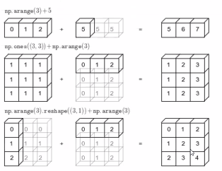

# Day 7 - Oct 11th 2025 - 
## 1. Joblib

C:\Users\manav>pip install joblib
Collecting joblib
  Downloading joblib-1.5.2-py3-none-any.whl.metadata (5.6 kB)
Downloading joblib-1.5.2-py3-none-any.whl (308 kB)
Installing collected packages: joblib
Successfully installed joblib-1.5.2

from sklearn.datasets import make_regression
from sklearn.linear_model import LinearRegression
from sklearn.model_selection import train_test_split
from sklearn.metrics import mean_squared_error

# Create dataset
X, y = make_regression(n_samples=100, n_features=1, noise=10, random_state=42)
X_train, X_test, y_train, y_test = train_test_split(X, y, test_size=0.2, random_state=42)

# Train model
model = LinearRegression()
model.fit(X_train, y_train)

# Evaluate
preds = model.predict(X_test)
print("MSE:", mean_squared_error(y_test, preds))


# Task 2: Serialize Model with Joblib
from joblib import dump

# Save model to file
dump(model, "linear_model.joblib")
print("Model saved successfully!")

---

## 2. Numpy
## Install numppy
```
C:\Users\manav>pip install numpy
Collecting numpy
  Downloading numpy-2.3.3-cp313-cp313-win_amd64.whl.metadata (60 kB)
Downloading numpy-2.3.3-cp313-cp313-win_amd64.whl (12.8 MB)
   ━━━━━━━━━━━━━━━━━━━━━━━━━━━━━━━━━━━━━━━━ 12.8/12.8 MB 11.3 MB/s  0:00:01
Installing collected packages: numpy
Successfully installed numpy-2.3.3
```
## Find the correct path of your correct python interperter if vscode

python -m pip show numpy # To find install path
open vscode and Press Ctrl + Shift + P
Open VS Code Command Palette

Press Ctrl + Shift + P (or Cmd + Shift + P on Mac).

2. Select Interpreter

Type and choose “Python: Select Interpreter”.
- you will get two option, recommanded or global
- select the global
- check the program again your program must rexognise the numpy in the py.


***

### What is numpy?

NumPy is the fundamental package for scientific computing in Python. It is a Python library that provides a multidimensional array object, various derived objects (such as masked arrays and matrices), and an assortment of routines for fast operations on arrays, including mathematical, logical, shape manipulation, sorting, selecting, I/O, discrete Fourier transforms, basic linear algebra, basic statistical operations, random simulation, and much more.

At the core of the NumPy package is the ndarray object. This encapsulates n-dimensional arrays of homogeneous data types.

***

### NumPy Arrays vs Python Sequences

- NumPy arrays have a fixed size at creation, unlike Python lists (which can grow dynamically). Changing the size of an ndarray will create a new array and delete the original.
- The elements in a NumPy array are all required to be of the same data type, and thus will be the same size in memory.
- NumPy arrays facilitate advanced mathematical and other types of operations on large numbers of data. Typically, such operations are executed more efficiently and with less code than is possible using Python's built-in sequences.
- A growing plethora of scientific and mathematical Python-based packages are using NumPy arrays; though these typically support Python-sequence input, they convert such input to NumPy arrays prior to processing, and they often output NumPy arrays.

Here are the notes from your screenshot, formatted in Markdown:

***

### Reference

1. NumPy Mathematical Functions - [https://numpy.org/doc/stable/reference/routines.math.html](https://numpy.org/doc/stable/reference/routines.math.html)
2. NumPy Universal Functions - [https://numpy.org/doc/stable/reference/ufuncs.html](https://numpy.org/doc/stable/reference/ufuncs.html)

---

### [A] Creating Numpy Arrays
import numpy as np
a = np.array([1,2,3,4,5])
print(a)
print(type(a))

### Creating 2D and 3D array - Check the school Matrix maths
```
1D: ([1,2,3])
2D: ([1,2,3], [3,5,6])
3D: ([1,2,3], [3,5,6], [1,7,0])
```
b = np.arrary([[1,2,3],[4,5,6]])
print(b)

c = np.arrary([[1,2],[4,5], [6,7], [8,9]])
print(c)

#dtype -
np.array([1,2,3],dtype=float)

# np.arrayrange (arange)
d = np.arange(1,100,-2)
print(d)


# Array with shape
e = np.arange(16).reshape(4,4) # to gives the shape in 4 row and 4 coloumn
print(e)
##
f = np.arange(100).reshape(2,10,5) # 2 row 10 coloumn and 5??
print(f)

## 1. Random floats between 0 and 1
arr = np.random.rand(3,4) #  (rows,coloumn)random is function and rand is inside the random . rand by default start from 0-1
print(arr)

## 1. Random integers
arr = np.random.randinit(11,20,size=(4,4)) # this first create 4*4 block then take randinit from 11 - 20


arr = np.arange(1,11),reshape(3,3) # it will work 3*3 = 9 and in arange 1-11 will take 1 to 10 as its in range always be default -1.

arr = np.arange(1,11),reshape(5,2) # it will work

arr = np.arange(1,10),reshape(3,3) # it will work not work due to range 

# Random numbers between any two values (e.g., 10 to 50)
arr = np.random.uniform(10, 50, size=(3, 4)) # in numpy - np, we have random function in that we are using uniform is this method or function?
print(arr) # Generates random floats between 10 and 50.

# Output

# Example with np.random.seed()

import numpy as np

np.random.seed(10)  # Set the random seed

arr1 = np.random.randint(1, 10, size=(3, 3))
print(arr1)

# Output will always be the same, for example:


arr1 = np.random.randint(1, 10, size=(3, 3))
print(arr1)


import numpy as np

np.random.seed(10)  # Set the random seed
# seed is like a milk dary if you mention any number there you will get the same output
# creamy, tonned and thin milk 

arr1 = np.random.randint(1, 10, size=(3, 3))
print(arr1)

# 1, 10 - it will take output between 1 to 10
# will create 3 row and 3 coloum
# np is numpy
# random - select any random number between 1,10 which we define
# see(x) - this is just a referece where get the same value for x if change to y then it will be different, without seed it will change the value. output will be always be the same 

np.random.seed(11)  # Set the random seed
# seed is like a milk dary if you mention any number there you will get the same output
# creamy, tonned and thin milk 

arr1 = np.random.randint(1, 10, size=(3, 3))
print(arr1)

np.random.seed(10)  # Set the random seed
# seed is like a milk dary if you mention any number there you will get the same output
# creamy, tonned and thin milk 

arr1 = np.random.randint(1, 10, size=(3, 3))
print(arr1)

# output - this will be every time change when you run it


# np.linspace : Linear Space between numbers or points
import numpy as np

x = np.linspace(-10, 10, 10, dtype=int)
print(x)

np.linspace(start, stop, num, dtype=int) generates num evenly spaced samples from start to stop (inclusive) as integers.

In the example above, it generates 10 evenly spaced integers between -10 and 10

Output:
[-10  -8  -6  -4  -2   1   3   5   7  10]


y = np.linspace(-10, 10, 10, dtype=int)

# Duplicate allowed linspace 

### [B] Array Attributes
import sys
import numpy as np
# one D arrary
# 10 is attribute of arrary
# dtype=np - second attribute of arrary
# reshape - is method 
# int32 - showing 32 bit but memeory calculating in python in bytes
a1 = np.arange(10, dtype=np.int32)
print('Memory usage by a1 :', sys.getsizeof(a1))
print(a1)
# one 2D arrary
a2 = np.arange(12, dtype=float).reshape(3, 4)
print('Memory usage by a2 :', sys.getsizeof(a2))
print(a2)
# one 3D arrary
a3 = np.arange(8).reshape(2, 2, 2)
print('Memory usage by a3 :', sys.getsizeof(a3))
print(a3)

# size of values or iteam in an array
print(a1.size)

# itemsize: size of value(memory occupied by each item)
print(a1.itemsize)


---

### [C] Changing Datatype 
# astype
print(a2.dtype)
print(a2)
a2 = a2.astype(np.int32)

print(a2.dtype)
print(a2)

### [D] Array Operations
a1 = np.arange(12).reshape(3, 4)
a2 = np.arange(12, 24).reshape(3, 4)

print(a1)
print('\n----------------------------\n')
print(a2)

## scalaor operations
- any single value is scalar howerver this can be define in list as weel
### arithemetic
a1 ** 2

#### relational

a2 == 15 # a2 is vecotr and 15 is scaler

## vector operations
- Multiple values is vector,
## vector - arithemetic 
a1 ** a2 

x = np.array([[1, 2], [3, 4]])
y = np.array([[5, 6], [7, 8]])

print(x ** y)
print('\n----------------------------\n')
print(np.power(x, y))


### [E] Array Functions 
a1 = np.random.random((3, 3))
print(a1)

#### Array Functions  - max min sum prod
# 0 --> column and 1 --> Row

# Array Functions  - max
print(np.max(a1)) # this will gives overall max value

print(np.max(a1,axis=0)) # this will gives column wise values as its 0

print(np.max(a1,axis=1)) # this will gives row wise values as its 1

# Array Functions  - min
print(np.min(a1)) # this will gives overall min value

print(np.min(a1,axis=0)) # this will gives column wise values as its 0

print(np.min(a1,axis=1)) # this will gives row wise values as its 1

# Array Functions  -sum
print(np.sum(a1)) # this will gives overall sum value

print(np.sum(a1,axis=0)) # this will gives column wise values as its 0

print(np.sum(a1,axis=1)) # this will gives row wise values as its 1

# Array Functions  - prod
print(np.prod(a1)) # this will gives overall prod value

print(np.prod(a1,axis=0)) # this will gives column wise values as its 0

print(np.prod(a1,axis=1)) # this will gives row wise values as its 1


# mean median std var
print(np.mean(a1))
print(np.mean(a1, axis=1))
print(np.std(a1, axis=1))
print(np.var(a1, axis=1))


# dot product
a2 = np.arange(12).reshape(3, 4)
a3 = np.arange(12, 24).reshape(4, 3)

print(a2)
print(------------\n)
print(a3)
print(------------\n)
np.dot(a2, a3)

# Log and exponents 
# Log and exponents
print(np.log(a1))
print(np.exp(a1))


# round/floor/ceil
a1 = np.round(np.random.random((2, 3))) # random is 
a2 = np.ceil(np.random.random((2, 3)) * 100)
a3 = np.floor(np.random.random((2, 3)) * 100)

print(a1)
print(a2)
print(a3)


a1 = np.round(np.random.random((2, 3)))
print(a1)
print(np.round(a1))


ceil -

a1 = np.ceil(np.random.random((2, 3))) # random is 
a2 = np.ceil(np.random.random((2, 3)) * 100)
a3 = np.floor(np.random.random((2, 3)) * 100)

print(a1)
print(a2)
print(a3)


a1 = np.ceil(np.random.random((2, 3)))
print(a1)
print(np.ceil(a1))

## Indexing and Slicing 
- this will help in broadcasting

# Indexing - single
this is normal program without indexing and slicking 
a1 = np.arange(10)
a2 = np.arange(12).reshape(3, 4)
a3 = np.arange(8).reshape(2, 2, 2)

print(a1)
print('\n-------------------\n')
print(a2)
print('\n-------------------\n')
print(a3)


now lets do with indexing 
a1[5]

# Indexing - 2d
a2 = np.arange(12).reshape(3, 4)
print(a2)
print('\n-------------------------\n')
print('a2[0,3]', a2[0,3])

# Indexing - 3D
a3 = np.arange(8).reshape(2, 2, 2)
# 2 - first one define how many matrix so it will 2 x 2 matrix 
# 2 - second one define row
# 2 - third one define coloum
print(a3)
print('\n-------------\n')
print(a3[1, 0, 1]) # a3[matrix_index, row_index, col_index]

# Slicing
arr = np.arrange(20)
print(arr)
print('\n-------------------\n')
print(arr[2:15:2])  # arr[start:stop:step]


---
ran = np.random.random(20)
print(ran)
print('\n-------------------\n')
print(ran[2:15:2])  # ran[start:stop:step]

---

import numpy as np
a2 = np.arange(12).reshape(3, 4)
print(a2)

a2[:2:,1::2] # ar[row_index[:2:],col_index[1::2]]
---
import numpy as np
a2 = np.arange(12).reshape(3, 4)
print(a2)

a2[1,0:3]

---
 # Slicking: 3D 
import numpy as np
a3 = np.arange(27).reshape(3, 3, 3)
print(a3)
print('\n----------------------\n')
print()

print(a3[::2,0,::2])

----

#
a1

for i in a1:
    print(i)


0
1
2
3
4
5
6
7
8
9

for i in np.nditer(a3):
    print(i)


# reshaping
# reshape
import numpy as np
a2 = np.arange(12).reshape(3, 4)
print(a2)
print('\n-------------------\n')
print(a2.reshape(4, 3))
print('\n-------------------\n')
print(a2.reshape(6, 2))


# transpose - row become coloum and colum becore row here
import numpy as np# Transpose
a2 = np.arange(12).reshape(3, 4)
print(a2)
print('------------------------')
print(np.transpose(a2))
print('------------------------')
print(a2.T)


## ravel 
import numpy as np# Transpose
a3 = np.arange(8).reshape(2, 2, 2)
print(a2)
print('----------------------')
print(a2.ravel())  # ravel: it convert array into 1D array...
print(a3.ravel())

## hstack - horizontal stack it will attach
a4 = np.arange(12).reshape(3, 4)
a5 = np.arange(12, 24).reshape(3, 4)

print(a4)
print('-------------------------')
print(a5)

np.hstack((a4, a5))


## vstack - horizontal stack it will attach
a4 = np.arange(12).reshape(3, 4)
a5 = np.arange(12, 24).reshape(3, 4)

print(a4)
print('-------------------------')
print(a5)

np.vstack((a4, a5))

## Horizontalb spliting - hsplit
a4 = np.arange(12).reshape(3, 4)

a1, a2 = np.hsplit(a4, 2)

print(a1)
print('--------------------------')
print(a2)


## vertical spliting - vsplit
# vertical splitting
a1, a2, a3 = np.vsplit(a4, 3)

print(a1)
print('-----------------------------')
print(a2)
print('-----------------------------')
print(a3)


###################


Here are the notes from your screenshot, formatted in Markdown:

***

### Numpy array vs Python lists ### Advance started here 

```python
# pythone list
# list
a = [i for i in range(1000000)]
b = [i for i in range(1000000, 2000000)]

c = []
import time

start = time.time()
for i in range(len(a)):
    c.append(a[i] + b[i])
print(time.time() - start)
```

```python
# Now performing using Numpy
# numpy
import numpy as np
import time 

a = np.arange(1000000)
b = np.arange(1000000, 2000000)

start = time.time()
c = a + b
print(time.time() - start)
```

### Memory comparision python list vs numpy 

# memory
```python
# memory consumption with normal sys
import numpy as np
a = [10 for i in range(1000000)]
import sys

sys.getsizeof(a)
```

c = np.arrange(10000000)
sys.getsizeof(c)

print(a[-1])
print(b[-1])
print(c[-1])

### Note: int8: to reduce the memory consumption

```python
# Memory with numpy
import numpy as np
b = np.arange(1000000, dtype=np.int8)
sys.getsizeof(b)
```
***

### Advanced Indexing
import numpy as np
a = np.arange(24).reshape(6,4)
print(a)

[[ 0  1  2  3]
 [ 4  5  6  7]
 [ 8  9 10 11]
 [12 13 14 15]
 [16 17 18 19]
 [20 21 22 23]]

 print([1,2])

print(np.int64(6))

print[a(1:2,1:3)]

### Advance Indexking - Fancy Indexging 
import numpy as np
a = np.arange(24).reshape(6,4)
print(a)

[[ 0  1  2  3]
 [ 4  5  6  7]
 [ 8  9 10 11]
 [12 13 14 15]
 [16 17 18 19]
 [20 21 22 23]]

 # Fancy Indexing
print(a[[0, 2, 3, -1]])  # Print Rows 0, 2, 3

print(a[:,[0, 2, 3]])  # Print Coloum 0, 2, 3


### Advance Indexking - Boolean indexing 
import numpy as np
a = np.arange(24).reshape(6,4)
print(a)

[[ 0  1  2  3]
 [ 4  5  6  7]
 [ 8  9 10 11]
 [12 13 14 15]
 [16 17 18 19]
 [20 21 22 23]]

# Boolean Indexing
a = np.random.randint(1, 100, 24).reshape(6, 4)
a


boolen arrary
a > 50


# Fin all number grater than 50
import numpy as np
a = np.arange(24).reshape(6,4)
print(a)

[[ 0  1  2  3]
 [ 4  5  6  7]
 [ 8  9 10 11]
 [12 13 14 15]
 [16 17 18 19]
 [20 21 22 23]]

 print(a[a > 50])


---
array([87, 51, 96, 61, 66, 89, 74], dtype=int32)
arr = a[a > 50].reshape(-1, 7)
print(arr)

arr2 = a.reshape(3, -1)
print(arr2)


# find all numbers greater than 50 and are even
a[(a > 50) & (a % 2 == 0)]
# Output: array([96, 66, 74], dtype=int32)


# find all numbers not divisible by 7
a[~(a % 7 == 0)]
# Example Output: array([31, 87, 13, 2, 51, 20, 50, 34, 23, 96, 9, 18, 38, 20, 6, 61, 66, 41, 89, 13, 74], dtype=int32)


***

### Broadcasting

The term broadcasting describes how NumPy treats arrays with different shapes during arithmetic operations. The smaller array is “broadcast” across the larger array so that they have compatible shapes.

## same shape
a = np.arange(6).reshape(2, 3)
b = np.arange(6, 12).reshape(2, 3)

print(a)
print('\\')
print(b)

print(a + b)

## Output - 
a:
[[0 1 2]
 [3 4 5]]

b:
[[ 6  7  8]
 [ 9 10 11]]

a + b:
[[ 6  8 10]
 [12 14 16]]


# differetn shaper
# diff shape
a = np.arange(6).reshape(2,3)
b = np.arange(3).reshape(1,3)

print(a)
print('\n----------------------\n')
print(b)
print('\n----------------------\n')
print(a + b)

## Output
This is our array A
[[0 1 2]
 [3 4 5]]

----------------------
This is our array B
[[0 1 2]]

----------------------


final output
[[0 2 4]
 [3 5 7]] = 
0+0 = 0, 1+1=2, 2+2=4
0+3 = 3, 4+1=5, 5+2=7 


***

### Broadcasting Rules

1. **Make the two arrays have the same number of dimensions.**
   - If the numbers of dimensions of the two arrays are different, add new dimensions with size 1 to the head of the array with the smaller dimension.

2. If there is a dimension whose size is not 1 in either of the two arrays, it cannot be broadcast and an error is raised.

#### Examples:

- `np.arange(3) + 5`
  
  ```
  [0 1 2]   +   [5 5 5]   =   [5 6 7]
  ```
- `np.ones((3,3)) + np.arange(3)`

  ```
  [[1 1 1]     [[0 1 2]
   [1 1 1]  +   [0 1 2]  =  [[1 2 3]
   [1 1 1]]     [0 1 2]]     [1 2 3]
                              [1 2 3]]
  ```
- `np.arange(3).reshape((3,1)) + np.arange(3)`

  ```
  [[0]      [0 1 2]
   [1]   +  [0 1 2]  =   [[0 1 2]
   [2]]      [0 1 2]       [1 2 3]
                             [2 3 4]]
  ```

***

import numpy as np 
x = np.arange(3)
y = np.arange(3)
print(x+y)

import numpy as np 
x = np.arange(3).reshape(1,3)
print(x)

y = np.arange(3)
print(x+y)
[[0 1 2]]
[[0 2 4]]


import numpy as np 
x = np.arange(6).reshape(3,2)
print(x)

y = np.arange(3).reshape(3,1)
print(y)

[[0 1]
 [2 3]
 [4 5]]
[[0]
 [1]
 [2]]
**Visual Reference (from your diagram):**



- Broadcasting enables arrays of different shapes to be used together in operations, by extending the dimensions as necessary.
- The rule above is essential for reshaping arrays so their shapes are compatible for broadcasting arithmetic.

# If there is a dimention whose size is not 1 in either of the two arrays, it cona't be broadcasted and an error is raised
# one dimention should be matched and second number should be 1 elese broadcasting will not possible 

import numpy as np 
x = np.arange(6).reshape(3, 2) 
y = np.arange(12).reshape(3, 4)
x + y
