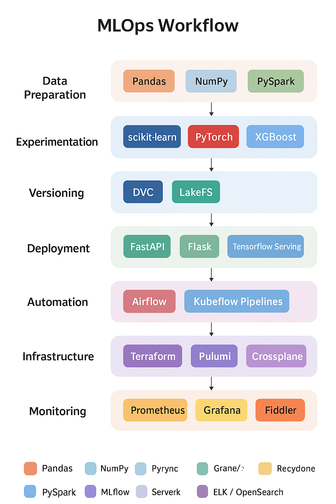
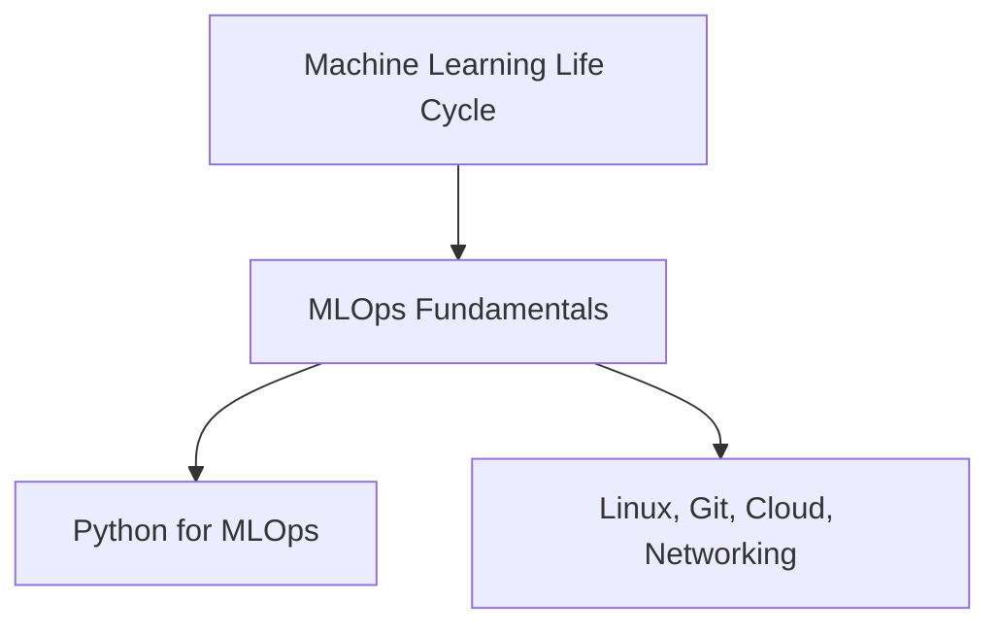
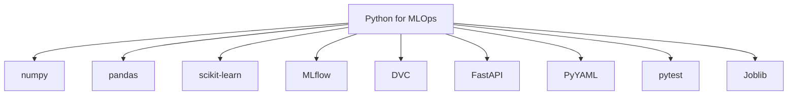
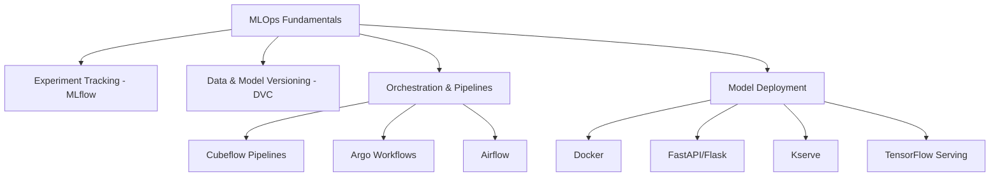
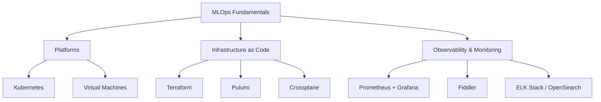

Great — you’ve listed a comprehensive set of Python tools, frameworks, and infrastructure technologies spanning the **entire ML lifecycle**. Let’s organize and clarify them by **category and purpose**, so it’s easier to understand how each fits into a real-world ML system or MLOps pipeline:

---

## 🧮 **Data Analysis & BI (Exploration & Visualization)**

| Tool                      | Purpose                                                              |
| ------------------------- | -------------------------------------------------------------------- |
| **NumPy**                 | Core numerical computing — arrays, matrices, math operations         |
| **Pandas**                | Data manipulation and analysis (tabular data, cleaning, joins, etc.) |
| **Matplotlib**            | Basic visualization — charts, plots, and graphs                      |
| *(Alt: Seaborn / Plotly)* | For richer visualization and dashboard-style plots                   |

---

## 🧠 **Machine Learning (Modeling & Experimentation)**

| Tool                           | Purpose                                                               |
| ------------------------------ | --------------------------------------------------------------------- |
| **scikit-learn**               | Core ML library (training, evaluation, pipelines, preprocessing)      |
| **PyTorch**                    | Deep learning framework (neural networks, GPUs, custom architectures) |
| **XGBoost**                    | Gradient boosting algorithm for structured/tabular data               |
| **Optuna**                     | Hyperparameter optimization framework                                 |
| **MLflow**                     | Experiment tracking, model registry, deployment management            |
| **DVC (Data Version Control)** | Dataset and model versioning integrated with Git                      |
| **Joblib**                     | Model serialization and parallel computation                          |
| **PyYAML**                     | Config management (read/write YAML experiment configs)                |
| **Pytest**                     | Automated testing for ML codebases                                    |

---

## ⚙️ **Automation & Software Engineering**

| Tool                | Purpose                                                     |
| ------------------- | ----------------------------------------------------------- |
| **Requests**        | HTTP client — interacting with APIs or services             |
| **Flask / FastAPI** | Build and deploy ML APIs or microservices                   |
| **Joblib**          | Parallel execution and caching (e.g., model training loops) |

---

## 🧱 **Data Engineering & Pipelines**

| Tool                             | Purpose                                                       |
| -------------------------------- | ------------------------------------------------------------- |
| **SQLAlchemy**                   | ORM and database interaction layer                            |
| **PySpark**                      | Distributed data processing at scale                          |
| **LakeFS**                       | Version control for data lakes (Git-like for object storage)  |
| **Airflow**                      | Workflow orchestration for data & ML pipelines                |
| **Kubeflow Pipelines / KFP DSL** | Define and run ML pipelines on Kubernetes                     |
| **Argo Workflows**               | Workflow engine for Kubernetes (basis for Kubeflow Pipelines) |

---

## 📦 **Model Serving & Containerization**

| Tool                    | Purpose                                                     |
| ----------------------- | ----------------------------------------------------------- |
| **KServe (KFServing)**  | Model serving on Kubernetes (supports TF, SKLearn, PyTorch) |
| **TensorFlow Serving**  | Serving TensorFlow models at scale                          |
| **Docker / Kubernetes** | Containerization and orchestration of ML services           |

---

## ☁️ **Infrastructure as Code (IaC)**

| Tool           | Purpose                                                                                 |
| -------------- | --------------------------------------------------------------------------------------- |
| **Terraform**  | Cloud infrastructure provisioning                                                       |
| **Pulumi**     | Infrastructure management using real programming languages                              |
| **Crossplane** | Cloud-native control plane for provisioning and managing cloud resources via Kubernetes |

---

## 🔍 **Monitoring & Logging**

| Tool                                            | Purpose                                              |
| ----------------------------------------------- | ---------------------------------------------------- |
| **Prometheus**                                  | Metrics collection (system and app-level monitoring) |
| **Grafana**                                     | Dashboarding and visualization for metrics           |
| **Fiddler**                                     | ML model performance monitoring & explainability     |
| **ELK Stack (Elasticsearch, Logstash, Kibana)** | Log collection, processing, and visualization        |
| **OpenSearch**                                  | Alternative to ELK for log analytics                 |

---

## 🧩 **How They Fit Together**

Here’s how you can imagine them working in an **ML system lifecycle**:

1. **Data Prep:** Pandas, PySpark, SQLAlchemy, LakeFS
2. **Experimentation:** NumPy, scikit-learn, PyTorch, Optuna, MLflow
3. **Versioning:** DVC, Git, MLflow registry, LakeFS
4. **Deployment:** FastAPI, Flask, Docker, KServe, TensorFlow Serving
5. **Automation:** Airflow, Kubeflow Pipelines, Argo Workflows
6. **Infra Management:** Terraform, Pulumi, Crossplane
7. **Monitoring:** Prometheus, Grafana, Fiddler, ELK/OpenSearch

---

```mermaid
graph TD
    A[Learn Machine Learning Life Cycle] --> B[Master MLOps Fundamentals]
    B --> C[Experiment Tracking with MLflow]
    B --> D[Data & Model Versioning with DVC]
    B --> E[Orchestration & Pipelines]
    E --> E1[Cubeflow Pipelines]
    E --> E2[Argo Workflows]
    E --> E3[Airflow]
    B --> F[Model Deployment]
    F --> F1[Docker]
    F --> F2[FastAPI/Flask]
    F --> F3[Kserve]
    F --> F4[TensorFlow Serving]
    B --> G[Platforms]
    G --> G1[Kubernetes]
    G --> G2[Virtual Machines]
    B --> H[Infrastructure as Code]
    H --> H1[Terraform]
    H --> H2[Pulumi]
    H --> H3[Crossplane]
    B --> I[Observability & Monitoring]
    I --> I1[Prometheus + Grafana]
    I --> I2[Fiddler]
    I --> I3[ELK Stack/OpenSearch]
    B --> J[Python for MLOps]
    J --> J1[numpy]
    J --> J2[pandas]
    J --> J3[scikit-learn]
    J --> J4[MLflow]
    J --> J5[DVC]
    J --> J6[FastAPI]
    J --> J7[PyYAML]
    J --> J8[pytest]
    J --> J9[Joblib]
    B --> K[Linux, Git, Cloud, Networking]
```

### Machine Learning Life Cycle & Fundamentals

### Python Packages for MLOps

### MLOps Core Practices

### Platforms, Infrastructure & Monitoring

