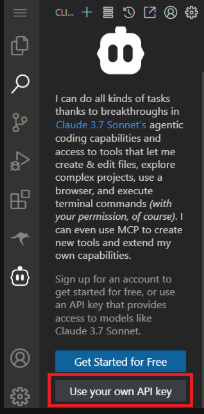

What is Model Context Protocol (MCP)?

A protocol or interface that defines how information (context) is structured, sent, and used when interacting with an AI model - especially multi-turn, tool-using, or agent-like systems.

Modern AI models need context to do intelligent reasoning. MCP helps organize this context in a structured, extensible way:

What was previously said? (conversation history)
What tools are available? (tool/function metadata)
What actions were taken? (and their outputs)
What the model is expected to do next?
We will be working with Cline in this lab. With an MCP server added in Cline you get a structured AI agent that can:

Reason step-by-step
Use tools
Remember context
Be inspected, versioned, and improved

Setting up Cline

First, let's set up Cline.

Open the Cline interface by clicking on the robot icon on the left panel of the embedded VSCode server:

Cline Robot Icon

Click on Use your own API key button on the interface that comes up:

Button

Note: Don't worry! We will provide the keys to you!

Add keys to Cline

Configure your API keys:

After clicking on the Use your own API key button, you should see a section asking you to make some selections.
For API Provider select OpenAI Compatible.
Get the values of environment variables OPENAI_API_BASE and OPENAI_API_KEY from the terminal:
echo $OPENAI_API_BASE
echo $OPENAI_API_KEY

Enter the values held by environment variables OPENAI_API_BASE for Base URL and OPENAI_API_KEY for API Key respectively.
Enter deepseek/deepseek-chat-v3-0324:free for Model ID.
After entering all these details into the Cline interface, scroll to the bottom and click on the Let's go! button.