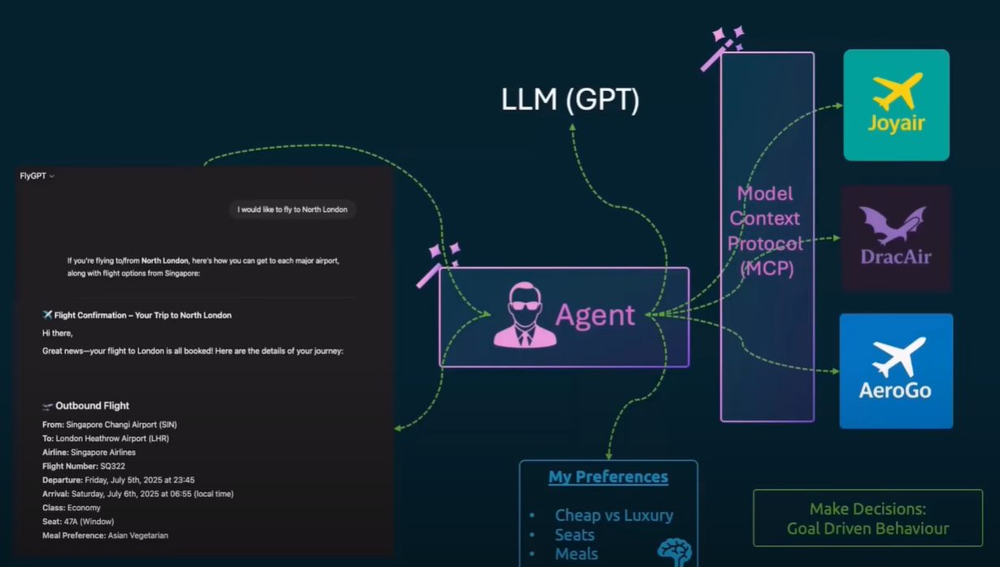
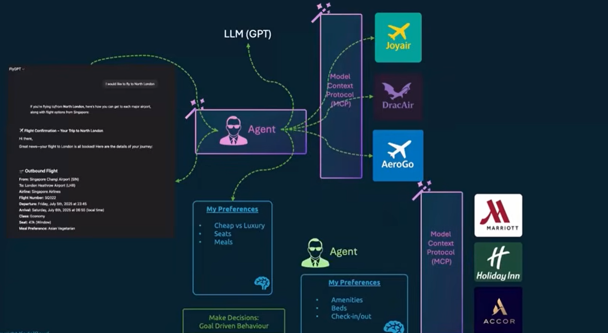
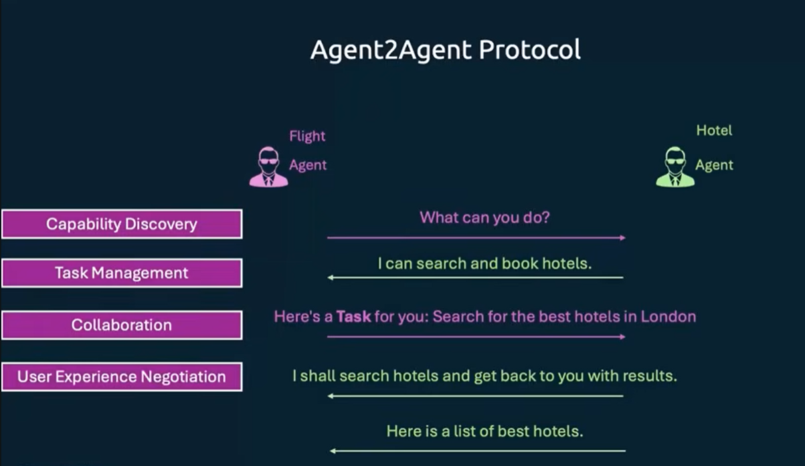

# API - Application Programming Interface

## Definition
An **API (Application Programming Interface)** is an interface that one application provides so that another application can interact with it.  
It defines **how software components should communicate with each other**.

---

## Example

Imagine you are on **Booking.com** checking flight details.  
Booking.com itself does not own flight data. Instead:  

- **Airline systems (like Emirates)** expose their flight information through **APIs**.  
- **Booking.com** calls those APIs to fetch real-time data (availability, timings, prices).  
- You see the results on Booking.com’s website/app, even though the source is Emirates’ system.

So here:
- **Emirates** → provides APIs (data source)  
- **Booking.com** → consumes APIs (displays data to the user → User Interface)  

---

## Analogy

Think of an **API** as a **restaurant waiter**:
- You (the customer/app) place an order (**request**).  
- The waiter (**API**) takes your request to the kitchen (**server/system**).  
- The kitchen prepares the dish (**data/service**).  
- The waiter brings it back to you (**response**).  

---

## MCP Architecture



### Tools
- Retrieve the information  
- Example:  
  ```bash
  curl https://www.joyair.com
``

* These details are shared with an **LLM (Large Language Model)** to make decisions.
* Based on the decision, the tool can make another API call (e.g., to **book the flight**).
* Each API call may differ, and each API response may differ.

👉 Every airline has its own APIs. In AI, we cannot manually write integration code for each API.

This is where **MCP (Model Context Protocol)** comes in.

---

## What is MCP?

* **MCP = Model Context Protocol**
* Built by **Anthropic** and **open source** → [GitHub repo](https://github.com/modelcontextprotocol/servers)
* Think of MCP as a **guide for APIs** that helps AI agents choose the right API and interact with third-party platforms.
* MCP provides **context** to agents so they can make the right API calls.

### Example: Flight MCP

MCP tells the agent that **JoyAir** has two capabilities:

* `searchFlights`
* `bookFlight`

The input/output schemas look like this:

```json
{
  "searchFlights": {
    "description": "Search flights from origin to destination on given date",
    "input_schema": {
      "origin": "string",
      "destination": "string",
      "date": "YYYY-MM-DD"
    },
    "output_schema": {
      "flights": "List of flight objects with number"
    }
  },
  "bookFlight": {
    "description": "Book a flight for a passenger",
    "input_schema": {
      "flightNumber": "string",
      "passenger": {
        "firstName": "string",
        "lastName": "string",
        "email": "string"
      },
      "seatPreference": "string"
    }
  }
}
```

---

## MCP Configuration

Every agent has an MCP configuration file (e.g., `mcp.json`) located in a defined path depending on the agent.

Example:

```json
{
  "mcpServers": {
    "MongoDB": {
      "command": "npx",  
      "args": [
        "-y",
        "mongodb-mcp-server",
        "--connectionString",
        "mongodb://localhost:27017/myDatabase"
      ]
    }
  }
}
```

* **MongoDB** → Name of MCP
* **mongodb-mcp-server** → Command & arguments associated with MongoDB
* **--connectionString** → MongoDB connection string argument
* **mongodb://localhost:27017/myDatabase** → Connection string to reach the database

👉 This allows the agent to use the MCP server to **connect to a database**, **retrieve information**, and **modify data**.

---

## MCP Servers and Clients

* MCP servers work in a **client-server model**.
* Instead of interacting with APIs directly:

  * Each third-party service (like airlines) has its own **MCP server**.
  * The agent uses an **MCP client** to interact with those servers.

💡 This combination of **AI agents** (with memory, goal-driven behavior, and LLMs) + **MCP servers** enables agents to **discover third-party capabilities** and build powerful solutions.

---

## Example: Hotel Booking Agent

* Suppose we want an agent to **book hotels** in addition to booking flights.
* We would add more MCP servers.
* But adding too many responsibilities can **bloat the agent**.

👉 Solution: **Specialized agents**.

* One agent for **airlines**
* Another agent for **hotels**
* Each with its own MCP integrations and memory of preferences.
* The airline agent can call the hotel agent → this is known as **Agent-to-Agent (A2A) communication**.



---

# Agent-to-Agent Model (A2A)

* How does one agent know the capabilities of another?

* In what format can one agent pass information to another?

* This is where the **A2A model** comes in.

* **A2A** was developed by **Google**.

* Goal: Make it possible for agents to collaborate in a **dynamic multi-agent ecosystem**.

---

## How A2A Works



### Example

1. Flight agent → asks hotel agent: *“What can you do?”*
2. Hotel agent → responds: *“I can search and book hotels.”*
3. Flight agent → assigns task: *“Search for the best hotels.”*
4. Hotel agent → responds with results.

### Features of A2A

* Defines standards for **discovering capabilities** between agents.
* Defines standards for **assigning tasks** to other agents and checking status.
* Defines standards for **communication** between agents.
* Defines how **context and results** are shared back and forth.

---
# Real-World Use Cases

---

## Scenario 1: Troubleshooting


We recently noticed that a **button was missing on the UI**.  
Task: *Help me identify when and how this change happened, and share a plan to revert it.*

How the AI Agent helps:
- Interacts with **Git history**  
- Reads both **frontend and backend code**  
- Identifies the exact **commit or change** that caused the issue  
- Suggests a plan to **revert or fix the change**  

---

## Scenario 2: Backend Development


We can use **AI agents + MCPs** to build backend applications.

Example:
- While developing APIs, the agent needs access to a **MongoDB database**.  
- During development, the agent can:  
  - Test the APIs directly  
  - Verify that data is correctly stored in **MongoDB**  
  - Ensure the backend is working as expected  

This enables **faster and automated backend development** with continuous testing.  

---

## Scenario 3: Data Engineering


We had **three data sources**:  
- **Stripe** (payment system)  
- **Google BigQuery** (data infrastructure)  
- **Metabase** (visualization platform)  

### Issue
- A particular **Stripe invoice record** was missing.  
- We couldn’t identify which **user** it belonged to.  

### Solution
- Tasked an **AI agent** with access to these 3 data sources (via **MCP servers**).  
- The agent performed a **5–10 min troubleshooting journey**.  
- It came back with:  
  - The **reason** for the missing invoice  
  - The **transaction ID**  
  - Further **details of the affected record**  


