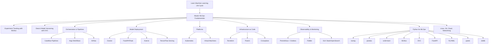

```mermaid
graph TD
    A[Learn Machine Learning Life Cycle] --> B[Master MLOps Fundamentals]
    B --> C[Experiment Tracking with MLflow]
    B --> D[Data & Model Versioning with DVC]
    B --> E[Orchestration & Pipelines]
    E --> E1[Cubeflow Pipelines]
    E --> E2[Argo Workflows]
    E --> E3[Airflow]
    B --> F[Model Deployment]
    F --> F1[Docker]
    F --> F2[FastAPI/Flask]
    F --> F3[Kserve]
    F --> F4[TensorFlow Serving]
    B --> G[Platforms]
    G --> G1[Kubernetes]
    G --> G2[Virtual Machines]
    B --> H[Infrastructure as Code]
    H --> H1[Terraform]
    H --> H2[Pulumi]
    H --> H3[Crossplane]
    B --> I[Observability & Monitoring]
    I --> I1[Prometheus + Grafana]
    I --> I2[Fiddler]
    I --> I3[ELK Stack/OpenSearch]
    B --> J[Python for MLOps]
    J --> J1[numpy]
    J --> J2[pandas]
    J --> J3[scikit-learn]
    J --> J4[MLflow]
    J --> J5[DVC]
    J --> J6[FastAPI]
    J --> J7[PyYAML]
    J --> J8[pytest]
    J --> J9[Joblib]
    B --> K[Linux, Git, Cloud, Networking]
```