```mermaid
graph TD
    A[Learn Machine Learning Life Cycle] --> B[Master MLOps Fundamentals]
    B --> C[Experiment Tracking with MLflow]
    B --> D[Data & Model Versioning with DVC]
    B --> E[Orchestration & Pipelines]
    E --> E1[Cubeflow Pipelines]
    E --> E2[Argo Workflows]
    E --> E3[Airflow]
    B --> F[Model Deployment]
    F --> F1[Docker]
    F --> F2[FastAPI/Flask]
    F --> F3[Kserve]
    F --> F4[TensorFlow Serving]
    B --> G[Platforms]
    G --> G1[Kubernetes]
    G --> G2[Virtual Machines]
    B --> H[Infrastructure as Code]
    H --> H1[Terraform]
    H --> H2[Pulumi]
    H --> H3[Crossplane]
    B --> I[Observability & Monitoring]
    I --> I1[Prometheus + Grafana]
    I --> I2[Fiddler]
    I --> I3[ELK Stack/OpenSearch]
    B --> J[Python for MLOps]
    J --> J1[numpy]
    J --> J2[pandas]
    J --> J3[scikit-learn]
    J --> J4[MLflow]
    J --> J5[DVC]
    J --> J6[FastAPI]
    J --> J7[PyYAML]
    J --> J8[pytest]
    J --> J9[Joblib]
    B --> K[Linux, Git, Cloud, Networking]
```

### Machine Learning Life Cycle & Fundamentals```mermaid
graph TD
    A[Machine Learning Life Cycle] --> B[MLOps Fundamentals]
    B --> C[Python for MLOps]
    B --> D[Linux, Git, Cloud, Networking]
```

### Python Packages for MLOps```mermaid
graph TD
    A[Python for MLOps] --> B[numpy]
    A --> C[pandas]
    A --> D[scikit-learn]
    A --> E[MLflow]
    A --> F[DVC]
    A --> G[FastAPI]
    A --> H[PyYAML]
    A --> I[pytest]
    A --> J[Joblib]
```

### MLOps Core Practices```mermaid
graph TD
    A[MLOps Fundamentals] --> B[Experiment Tracking - MLflow]
    A --> C[Data & Model Versioning - DVC]
    A --> D[Orchestration & Pipelines]
    D --> D1[Cubeflow Pipelines]
    D --> D2[Argo Workflows]
    D --> D3[Airflow]
    A --> E[Model Deployment]
    E --> E1[Docker]
    E --> E2[FastAPI/Flask]
    E --> E3[Kserve]
    E --> E4[TensorFlow Serving]
```

### Platforms, Infrastructure & Monitoring```mermaid
graph TD
    A[MLOps Fundamentals] --> B[Platforms]
    B --> B1[Kubernetes]
    B --> B2[Virtual Machines]
    A --> C[Infrastructure as Code]
    C --> C1[Terraform]
    C --> C2[Pulumi]
    C --> C3[Crossplane]
    A --> D[Observability & Monitoring]
    D --> D1[Prometheus + Grafana]
    D --> D2[Fiddler]
    D --> D3[ELK Stack / OpenSearch]
```
