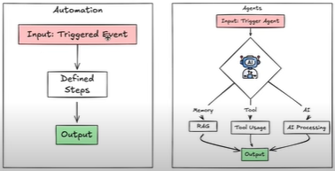

# **Module 1 – Automation**

## **What are Automations?**

Automation is the process of using technology to perform tasks without human intervention, making repetitive or time-consuming activities faster and more efficient.

**Key traits of Automations:**

* Follow a fixed, rule-based process
* Great for repetitive and predictable tasks
* **Deterministic and predefined**

**Examples:**

* Automatically sending a **welcome email** to a new subscriber after they sign up for a newsletter
* A **coffee machine** programmed to brew coffee at 7:00 AM every day

---

## **What are Agents?**

An **AI Agent** is a node that uses artificial intelligence to perform *adaptive* tasks—like analyzing text, making decisions, or responding to context.

Think of an AI agent as a **super-smart assistant**:

* It doesn’t just follow predefined steps.
* It understands context and adapts actions accordingly.

**Automation vs. Agent Example (Coffee Machine):**

* **Automation:** Coffee machine makes coffee every day at 7:00 AM, no matter what (even if you’re not home or wake up at 10:00 AM).
* **Agent:** Coffee machine “understands” your routine. If you wake up at 10:00 AM, it waits and makes coffee *then*.

**Other examples:**

* A robotic vacuum cleaner that detects the environment and cleans adaptively
* Agents behave in a **non-deterministic** way, since inputs and outputs are not strictly predefined

---

## **Automation vs Agent – Components**

| **Aspect**        | **Automation** (Rule-Based)                 | **Agent** (AI-Powered)                                   |
| ----------------- | ------------------------------------------- | -------------------------------------------------------- |
| **Trigger/Input** | Fixed event (e.g., signup, time-based)      | Dynamic, context-aware (environment, user behavior)      |
| **Process Logic** | Predefined, deterministic rules             | Adaptive reasoning with LLMs/AI                          |
| **Memory**        | None (stateless)                            | Has memory (short-term & long-term, often via RAG)       |
| **Tools**         | Limited integrations (e.g., email, webhook) | Wide tool usage (search, APIs, reasoning)                |
| **Output**        | Fixed & predictable                         | Variable, depends on context                             |
| **Flexibility**   | Rigid (cannot adapt to unexpected inputs)   | Flexible, adapts to changing conditions                  |
| **Example**       | Send email at signup                        | Write a personalized email after analyzing user behavior |

---

# **Flow**

```
Input  ===>  Action(s)  ===>  Output
(trigger)
```

* **Automation Flow:**

  * **Input:** Triggered event
  * **Steps:** Predefined sequence of actions (rule-based)

* **Agent Flow:**

  * **Input:** Triggered by an *agent*
  * **Processing:** AI system with memory, tools, and reasoning (LLM-powered)

    * Memory → RAG (Retrieval-Augmented Generation)
    * Tools → Tool usage
    * AI → Decision-making & processing
  * **Output:** Adaptive result

---



---

## **n8n Workflow Examples**

### **Automation Workflow in n8n**

* **Trigger:** New user signs up (Webhook / App trigger)
* **Actions:**

  1. Create a new contact in CRM
  2. Send a predefined “Welcome Email” via Gmail/SMTP node
  3. Log event in Google Sheets

➡️ Every user gets the same message, regardless of behavior.

**Visual:**

```
[Webhook Trigger] → [Create Contact] → [Send Email] → [Log in Sheets]
```

---

### **Agent Workflow in n8n**

* **Trigger:** New user signs up
* **Actions (Adaptive):**

  1. Save user info to database (memory)
  2. Use **AI Agent Node (LLM)** to analyze user profile (e.g., signup time, location, preferences)
  3. Agent decides:

     * If user signs up late at night → Send “Night Owl” themed welcome email
     * If user is from a specific region → Include local resources in the message
  4. Log personalized response in Google Sheets

➡️ Each user gets a *different* email, based on context and reasoning.

**Visual:**

```
[Webhook Trigger] → [Save Data] → [AI Agent Node] → [Decision Branch] → [Personalized Email] → [Log in Sheets]
```

---

# Module 2: n8n as an Automation tool

